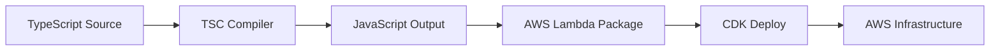
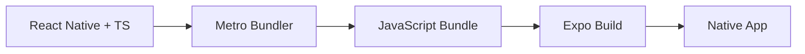

# Trinity - Lenguajes de Programación y Tecnologías

## 🚀 Stack Tecnológico Completo

Trinity utiliza un stack moderno y robusto que combina las mejores tecnologías para desarrollo móvil y backend serverless.

## 📱 Frontend - React Native + TypeScript

### React Native
**¿Qué es?** Framework de desarrollo móvil creado por Facebook que permite escribir aplicaciones nativas usando JavaScript/TypeScript.

**¿Por qué React Native?**
- **Código Compartido**: Una sola base de código para iOS y Android
- **Performance Nativa**: Renderizado nativo, no webview
- **Ecosistema Rico**: Miles de librerías disponibles
- **Hot Reload**: Desarrollo rápido con recarga instantánea

### TypeScript
**¿Qué es?** Superset de JavaScript que añade tipado estático opcional.

**Ventajas en Trinity:**
```typescript
// ✅ Tipado fuerte previene errores
interface Room {
  id: string;
  code: string;
  hostId: string;
  mediaType: 'MOVIE' | 'TV';
  genreIds: number[];
}

// ✅ Autocompletado y validación en tiempo de desarrollo
const createRoom = async (input: CreateRoomInput): Promise<Room> => {
  // TypeScript valida que input tenga la estructura correcta
  return await roomService.create(input);
};
```

**Beneficios Específicos:**
- **Detección Temprana de Errores**: Errores encontrados en desarrollo, no en producción
- **Mejor IDE Support**: Autocompletado, refactoring automático
- **Documentación Viva**: Los tipos sirven como documentación
- **Refactoring Seguro**: Cambios propagados automáticamente

### Expo
**¿Qué es?** Plataforma que simplifica el desarrollo React Native.

**Características Utilizadas:**
- **Expo CLI**: Herramientas de desarrollo
- **EAS Build**: Compilación en la nube
- **Expo Notifications**: Push notifications
- **Expo Updates**: Actualizaciones OTA (Over The Air)

## ⚡ Backend - AWS Lambda + TypeScript

### AWS Lambda con TypeScript
**¿Por qué TypeScript en el Backend?**

```typescript
// ✅ Handlers tipados previenen errores de runtime
export const handler: Handler<AppSyncEvent, Room[]> = async (event) => {
  // TypeScript valida que event tenga la estructura correcta
  const userId = event.identity?.claims?.sub;
  
  if (!userId) {
    throw new Error('User not authenticated');
  }
  
  return await roomService.getMyRooms(userId);
};
```

**Ventajas del Tipado en Lambda:**
- **Validación de Eventos**: Estructura de eventos AppSync validada
- **Respuestas Consistentes**: Tipos de retorno garantizados
- **Integración con AWS SDK**: Tipado completo de servicios AWS
- **Error Handling**: Manejo de errores más robusto

### Compilación TypeScript → JavaScript
```bash
# Proceso de build
TypeScript (.ts) → Compilador → JavaScript (.js) → AWS Lambda
```

**Configuración TypeScript para Lambda:**
```json
{
  "compilerOptions": {
    "target": "ES2020",
    "module": "commonjs",
    "lib": ["ES2020"],
    "outDir": "./dist",
    "strict": true,
    "esModuleInterop": true,
    "skipLibCheck": true
  }
}
```

## 🔧 Infrastructure as Code - AWS CDK + TypeScript

### AWS CDK (Cloud Development Kit)
**¿Qué es?** Framework para definir infraestructura cloud usando lenguajes de programación familiares.

**Ventajas sobre CloudFormation/Terraform:**
```typescript
// ✅ Código reutilizable y tipado
const createLambdaFunction = (name: string, handler: string) => {
  return new lambda.Function(this, name, {
    runtime: lambda.Runtime.NODEJS_18_X,
    handler,
    code: lambda.Code.fromAsset(path.join(__dirname, '../src/handlers')),
    timeout: cdk.Duration.seconds(30),
  });
};

// ✅ Reutilización
const roomHandler = createLambdaFunction('RoomHandler', 'room/index.handler');
const voteHandler = createLambdaFunction('VoteHandler', 'vote/index.handler');
```

**Beneficios del CDK:**
- **Tipado Fuerte**: Errores de configuración detectados en desarrollo
- **Reutilización**: Componentes reutilizables (constructs)
- **IDE Support**: Autocompletado para recursos AWS
- **Abstracción**: Patrones comunes simplificados

## 🗄️ Esquemas y Consultas - GraphQL

### GraphQL
**¿Qué es?** Lenguaje de consulta y runtime para APIs que permite a los clientes solicitar exactamente los datos que necesitan.

**Ventajas sobre REST:**
```graphql
# ✅ Una sola consulta para datos relacionados
query GetRoomWithDetails($roomId: ID!) {
  getRoom(id: $roomId) {
    id
    code
    mediaType
    candidates {
      id
      title
      posterPath
    }
  }
}

# ❌ En REST serían múltiples llamadas:
# GET /rooms/123
# GET /rooms/123/candidates
```

**Schema Definition Language (SDL):**
```graphql
type Room {
  id: ID!
  code: String!
  hostId: String!
  mediaType: MediaType!
  genreIds: [Int!]!
  candidates: [MovieCandidate!]!
  createdAt: AWSDateTime!
}

enum MediaType {
  MOVIE
  TV
}
```

## 🎨 Styling y UI - React Native StyleSheet

### StyleSheet API
```typescript
// ✅ Estilos tipados y optimizados
const styles = StyleSheet.create({
  container: {
    flex: 1,
    backgroundColor: '#1a1a1a',
    padding: 16,
  },
  movieCard: {
    backgroundColor: '#2a2a2a',
    borderRadius: 12,
    padding: 16,
    marginBottom: 12,
  },
  title: {
    fontSize: 18,
    fontWeight: 'bold',
    color: '#ffffff',
  },
});
```

**Ventajas:**
- **Performance**: Estilos compilados a código nativo
- **Tipado**: TypeScript valida propiedades CSS
- **Reutilización**: Estilos compartidos entre componentes

## 🔄 Gestión de Estado - React Context + Hooks

### React Context API
```typescript
// ✅ Estado global tipado
interface AuthContextType {
  user: User | null;
  isLoading: boolean;
  signIn: (email: string, password: string) => Promise<void>;
  signOut: () => Promise<void>;
}

const AuthContext = createContext<AuthContextType | null>(null);

// ✅ Hook personalizado tipado
export const useAuth = (): AuthContextType => {
  const context = useContext(AuthContext);
  if (!context) {
    throw new Error('useAuth must be used within AuthProvider');
  }
  return context;
};
```

### Custom Hooks
```typescript
// ✅ Lógica reutilizable y tipada
export const useMatchPolling = (
  userId: string,
  onMatch: (match: Match) => void
) => {
  const [isPolling, setIsPolling] = useState(false);
  
  const startPolling = useCallback(() => {
    // Lógica de polling
  }, [userId, onMatch]);
  
  return { isPolling, startPolling, stopPolling };
};
```

## 📦 Gestión de Dependencias

### Package Managers
- **npm**: Gestor de paquetes principal
- **package-lock.json**: Versiones exactas para builds reproducibles

### Dependencias Principales

#### Frontend (Mobile)
```json
{
  "dependencies": {
    "react-native": "^0.72.0",
    "expo": "^49.0.0",
    "@aws-amplify/core": "^5.8.0",
    "@react-navigation/native": "^6.1.0",
    "react-native-vector-icons": "^10.0.0"
  },
  "devDependencies": {
    "@types/react": "^18.2.0",
    "typescript": "^5.0.0",
    "@typescript-eslint/eslint-plugin": "^6.0.0"
  }
}
```

#### Backend (Infrastructure)
```json
{
  "dependencies": {
    "aws-cdk-lib": "^2.100.0",
    "@aws-sdk/client-dynamodb": "^3.400.0",
    "@aws-sdk/client-lambda": "^3.400.0"
  },
  "devDependencies": {
    "typescript": "^5.0.0",
    "@types/node": "^20.0.0",
    "ts-node": "^10.9.0"
  }
}
```

## 🧪 Testing y Calidad de Código

### Testing Framework
```typescript
// ✅ Tests tipados con Jest
describe('RoomService', () => {
  it('should create room with valid input', async () => {
    const input: CreateRoomInput = {
      mediaType: 'MOVIE',
      genreIds: [28, 12]
    };
    
    const result = await roomService.createRoom('user123', input);
    
    expect(result).toMatchObject({
      id: expect.any(String),
      code: expect.stringMatching(/^[A-Z0-9]{6}$/),
      hostId: 'user123'
    });
  });
});
```

### Linting y Formatting
```json
// .eslintrc.js
{
  "extends": [
    "@typescript-eslint/recommended",
    "prettier"
  ],
  "rules": {
    "@typescript-eslint/no-unused-vars": "error",
    "@typescript-eslint/explicit-function-return-type": "warn"
  }
}
```

## 🔄 Build y Deployment Pipeline

### TypeScript Compilation Flow


### Mobile Build Flow


## 📊 Ventajas del Stack Elegido

### Consistencia de Lenguaje
- **TypeScript en todo el stack**: Frontend, Backend, Infrastructure
- **Reutilización de tipos**: Interfaces compartidas entre capas
- **Tooling unificado**: ESLint, Prettier, Jest

### Developer Experience
- **Hot Reload**: Desarrollo rápido en mobile
- **Type Safety**: Errores detectados en desarrollo
- **IDE Support**: Autocompletado y refactoring
- **Debugging**: Source maps y breakpoints

### Mantenibilidad
- **Código autodocumentado**: Tipos como documentación
- **Refactoring seguro**: Cambios propagados automáticamente
- **Testing robusto**: Mocks tipados y validaciones

### Performance
- **Compilación optimizada**: Dead code elimination
- **Bundle splitting**: Código cargado bajo demanda
- **Tree shaking**: Solo código usado incluido

---

Este stack tecnológico proporciona una base sólida para Trinity, combinando la productividad del desarrollo moderno con la robustez necesaria para una aplicación en producción.