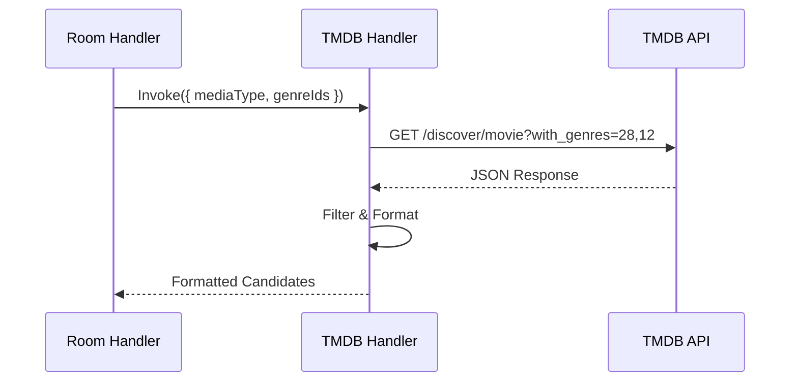
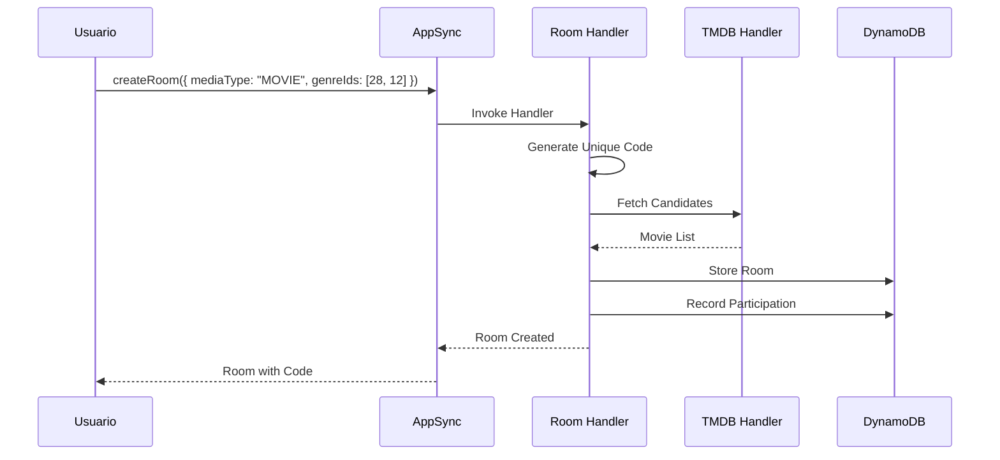
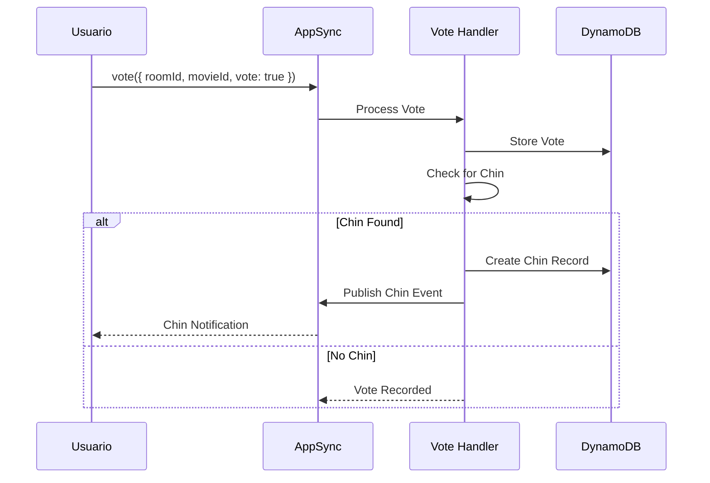
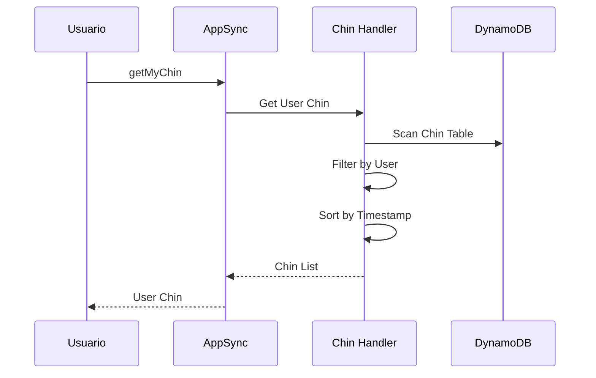

# Trinity - Funciones Lambda Detalladas

## 🏗️ Arquitectura de Microservicios Lambda

Trinity utiliza **4 funciones Lambda especializadas** que funcionan como microservicios independientes, cada una con responsabilidades específicas y bien definidas.

## 📋 Resumen de Funciones Lambda

| Función | Propósito | Triggers | Conecta con |
|---------|-----------|----------|-------------|
| **TMDB Handler** | Integración con API externa | Invocación directa | TMDB API |
| **Room Handler** | Gestión de salas | GraphQL Resolvers | DynamoDB, TMDB Handler |
| **Vote Handler** | Procesamiento de votos | GraphQL Resolvers | DynamoDB, AppSync |
| **Chin Handler** | Gestión de chines | GraphQL Resolvers | DynamoDB |

## 🎬 TMDB Handler - Integración con API Externa

### Propósito
Actúa como proxy y cache inteligente para la API de The Movie Database (TMDB), proporcionando datos de películas y series optimizados para Trinity.

### Responsabilidades
- Obtener candidatos de películas/series por género
- Filtrar y formatear resultados para la aplicación
- Manejar rate limiting y errores de API externa
- Optimizar requests para reducir latencia

### Configuración
```typescript
const tmdbHandler = new lambda.Function(this, 'TmdbHandler', {
  runtime: lambda.Runtime.NODEJS_18_X,
  handler: 'index.handler',
  code: lambda.Code.fromAsset('src/handlers/tmdb'),
  environment: {
    TMDB_API_KEY: process.env.TMDB_API_KEY,
    TMDB_READ_TOKEN: process.env.TMDB_READ_TOKEN,
  },
  timeout: cdk.Duration.seconds(30),
  memorySize: 128,
});
```

### Flujo de Ejecución


### Estructura del Handler
```typescript
interface TMDBEvent {
  mediaType: 'MOVIE' | 'TV';
  genreIds?: number[];
  page?: number;
}

interface TMDBResponse {
  statusCode: number;
  body: {
    candidates: MovieCandidate[];
    totalPages: number;
    currentPage: number;
  };
}

export const handler: Handler<TMDBEvent, TMDBResponse> = async (event) => {
  try {
    const { mediaType, genreIds = [], page = 1 } = event;
    
    // Construir URL de TMDB
    const endpoint = mediaType === 'MOVIE' ? '/discover/movie' : '/discover/tv';
    const params = new URLSearchParams({
      with_genres: genreIds.join(','),
      page: page.toString(),
      sort_by: 'popularity.desc',
      'vote_average.gte': '6.0',
      'vote_count.gte': '100'
    });
    
    // Llamada a TMDB API
    const response = await fetch(`${TMDB_BASE_URL}${endpoint}?${params}`, {
      headers: {
        'Authorization': `Bearer ${process.env.TMDB_READ_TOKEN}`,
        'Content-Type': 'application/json'
      }
    });
    
    const data = await response.json();
    
    // Formatear candidatos
    const candidates = data.results.map(formatCandidate);
    
    return {
      statusCode: 200,
      body: {
        candidates,
        totalPages: data.total_pages,
        currentPage: page
      }
    };
    
  } catch (error) {
    console.error('TMDB Handler error:', error);
    return {
      statusCode: 500,
      body: { error: 'Failed to fetch movie data' }
    };
  }
};
```

### Optimizaciones Implementadas
- **Filtrado por Calidad**: Solo películas con rating > 6.0 y > 100 votos
- **Ordenamiento**: Por popularidad descendente
- **Paginación**: Soporte para múltiples páginas
- **Error Handling**: Manejo robusto de errores de red

## 🏠 Room Handler - Gestión de Salas

### Propósito
Gestiona el ciclo de vida completo de las salas de votación, desde la creación hasta la participación de usuarios.

### Responsabilidades
- Crear salas con códigos únicos
- Permitir unión a salas existentes
- Listar salas del usuario (sin chines)
- Registrar participación de usuarios
- Validar expiración de salas (TTL)

### Configuración
```typescript
const roomHandler = new lambda.Function(this, 'RoomHandler', {
  runtime: lambda.Runtime.NODEJS_18_X,
  handler: 'index.handler',
  code: lambda.Code.fromAsset('src/handlers/room'),
  environment: {
    ROOMS_TABLE: roomsTable.tableName,
    VOTES_TABLE: votesTable.tableName,
    MATCHES_TABLE: chinesTable.tableName,
    TMDB_LAMBDA_ARN: tmdbHandler.functionArn,
  },
  timeout: cdk.Duration.seconds(30),
});
```

### GraphQL Operations Manejadas
```graphql
type Mutation {
  createRoom(input: CreateRoomInput!): Room!
  joinRoom(code: String!): Room!
}

type Query {
  getMyRooms: [Room!]!
  getRoom(id: String!): Room
}
```

### Flujo: Crear Sala


### Algoritmo de Generación de Códigos
```typescript
class RoomCodeGenerator {
  private static readonly CHARACTERS = 'ABCDEFGHIJKLMNOPQRSTUVWXYZ0123456789';
  private static readonly CODE_LENGTH = 6;

  static async generateUnique(docClient: DynamoDBDocumentClient, tableName: string): Promise<string> {
    let attempts = 0;
    const maxAttempts = 10;

    while (attempts < maxAttempts) {
      const code = this.generate();
      
      // Verificar unicidad usando GSI
      const result = await docClient.send(new QueryCommand({
        TableName: tableName,
        IndexName: 'code-index',
        KeyConditionExpression: 'code = :code',
        ExpressionAttributeValues: { ':code': code },
      }));

      if (!result.Items || result.Items.length === 0) {
        return code; // Código único encontrado
      }
      
      attempts++;
    }

    throw new Error('Failed to generate unique room code');
  }
}
```

### Lógica de getMyRooms
```typescript
async getMyRooms(userId: string): Promise<Room[]> {
  const allRooms: Room[] = [];

  // 1. Salas donde el usuario es host
  const hostRooms = await this.scanRoomsByHost(userId);
  allRooms.push(...hostRooms);

  // 2. Salas donde el usuario ha participado
  const participatedRooms = await this.getRoomsFromParticipation(userId);
  allRooms.push(...participatedRooms);

  // 3. Filtrar salas expiradas
  const now = Math.floor(Date.now() / 1000);
  const activeRooms = allRooms.filter(room => !room.ttl || room.ttl >= now);

  // 4. Filtrar salas con chines
  const roomsWithoutChin = await this.filterRoomsWithoutChin(activeRooms);

  return roomsWithoutChin.sort((a, b) => 
    new Date(b.createdAt).getTime() - new Date(a.createdAt).getTime()
  );
}
```

## 🗳️ Vote Handler - Procesamiento de Votos

### Propósito
Procesa votos de usuarios y detecta automáticamente chines cuando todos los participantes votan positivamente por la misma película.

### Responsabilidades
- Registrar votos individuales
- Detectar chines automáticamente
- Publicar eventos de chines
- Validar integridad de votos
- Prevenir votos duplicados

### Configuración
```typescript
const voteHandler = new lambda.Function(this, 'VoteHandler', {
  runtime: lambda.Runtime.NODEJS_18_X,
  handler: 'index.handler',
  code: lambda.Code.fromAsset('src/handlers/vote'),
  environment: {
    VOTES_TABLE: votesTable.tableName,
    MATCHES_TABLE: chinesTable.tableName,
    ROOMS_TABLE: roomsTable.tableName,
    GRAPHQL_ENDPOINT: api.graphqlUrl,
  },
  timeout: cdk.Duration.seconds(30),
});
```

### GraphQL Operation
```graphql
type Mutation {
  vote(input: VoteInput!): VoteResult!
}

input VoteInput {
  roomId: String!
  movieId: Int!
  vote: Boolean!
}

type VoteResult {
  success: Boolean!
  chin: Chin
}
```

### Flujo de Procesamiento de Voto


### Algoritmo de Detección de Chin
```typescript
async processVote(userId: string, roomId: string, movieId: number, vote: boolean): Promise<VoteResult> {
  // 1. Registrar voto
  await this.storeVote(userId, roomId, movieId, vote);
  
  // 2. Solo verificar chines para votos positivos
  if (!vote) {
    return { success: true };
  }
  
  // 3. Obtener todos los votos positivos para esta película
  const positiveVotes = await this.getPositiveVotes(roomId, movieId);
  
  // 4. Obtener usuarios únicos que han participado en la sala
  const totalUsers = await this.getTotalUsers(roomId);
  
  // 5. Verificar si todos han votado positivamente
  if (positiveVotes.length === totalUsers.length && totalUsers.length > 1) {
    // ¡MATCH ENCONTRADO!
    const chin = await this.createChin(roomId, movieId, positiveVotes);
    await this.publishChinEvent(chin);
    
    return { 
      success: true, 
      chin 
    };
  }
  
  return { success: true };
}
```

### Prevención de Votos Duplicados
```typescript
// Usar composite key para prevenir duplicados
const voteKey = {
  roomId: roomId,
  userMovieId: `${userId}#${movieId}`
};

// Upsert (insert or update)
await docClient.send(new PutCommand({
  TableName: this.votesTable,
  Item: {
    ...voteKey,
    userId,
    movieId,
    vote,
    timestamp: new Date().toISOString()
  }
}));
```

## 🎯 Chin Handler - Gestión de Chin

### Propósito
Gestiona el historial y consulta de chines encontrados, proporcionando funcionalidades de búsqueda y estadísticas.

### Responsabilidades
- Consultar chines del usuario
- Proporcionar detalles de chines
- Gestionar historial de chines
- Generar estadísticas de usuario

### Configuración
```typescript
const chinHandler = new lambda.Function(this, 'ChinHandler', {
  runtime: lambda.Runtime.NODEJS_18_X,
  handler: 'index.handler',
  code: lambda.Code.fromAsset('src/handlers/chin'),
  environment: {
    MATCHES_TABLE: chinesTable.tableName,
    GRAPHQL_ENDPOINT: api.graphqlUrl,
  },
  timeout: cdk.Duration.seconds(30),
});
```

### GraphQL Operations
```graphql
type Query {
  getMyChin: [Chin!]!
  checkUserChin: [Chin!]!
}
```

### Flujo de Consulta de Chin


### Lógica de getMyChin
```typescript
async getMyChin(userId: string): Promise<Chin[]> {
  // Scan toda la tabla de chines (optimizable con GSI)
  const result = await docClient.send(new ScanCommand({
    TableName: this.chinesTable,
    FilterExpression: 'contains(chinedUsers, :userId)',
    ExpressionAttributeValues: {
      ':userId': userId
    }
  }));

  const chines = result.Items as Chin[];
  
  // Ordenar por timestamp descendente (más recientes primero)
  return chines.sort((a, b) => 
    new Date(b.timestamp).getTime() - new Date(a.timestamp).getTime()
  );
}
```

## 🔄 Interconexión entre Funciones

### Invocación Directa: Room → TMDB
```typescript
// Room Handler invoca TMDB Handler directamente
const command = new InvokeCommand({
  FunctionName: process.env.TMDB_LAMBDA_ARN,
  Payload: JSON.stringify({
    mediaType: 'MOVIE',
    genreIds: [28, 12]
  }),
});

const response = await lambdaClient.send(command);
const result = JSON.parse(new TextDecoder().decode(response.Payload));
```

### Comunicación via AppSync: Vote → Chin Notifications
```typescript
// Vote Handler publica evento via AppSync
const mutation = `
  mutation PublishUserChin($userId: ID!, $chinData: RoomChinInput!) {
    publishUserChin(userId: $userId, chinData: $chinData) {
      userId
      chinId
      movieTitle
    }
  }
`;

await graphqlClient.request(mutation, {
  userId: user.id,
  chinData: chinDetails
});
```

## 📊 Métricas y Monitoreo

### CloudWatch Metrics por Función
```typescript
// Logging estructurado en cada función
console.log(JSON.stringify({
  timestamp: new Date().toISOString(),
  level: 'INFO',
  service: 'room-handler',
  operation: 'createRoom',
  userId: userId,
  roomId: roomId,
  duration: Date.now() - startTime,
  success: true
}));
```

### Métricas Clave
- **Invocaciones por función**
- **Duración promedio**
- **Errores por función**
- **Concurrencia**
- **Throttling**

## 🔧 Optimizaciones Implementadas

### Cold Start Mitigation
- **Provisioned Concurrency**: Para funciones críticas
- **Connection Pooling**: Reutilización de conexiones DynamoDB
- **Lazy Loading**: Inicialización bajo demanda

### Error Handling
- **Exponential Backoff**: Para reintentos
- **Dead Letter Queues**: Para errores persistentes
- **Circuit Breaker**: Para servicios externos

### Performance
- **Batch Operations**: Múltiples operaciones DynamoDB
- **Parallel Processing**: Operaciones concurrentes cuando es posible
- **Caching**: Resultados frecuentes en memoria

---

Esta arquitectura de funciones Lambda proporciona a Trinity un backend robusto, escalable y mantenible, donde cada función tiene responsabilidades claras y bien definidas.