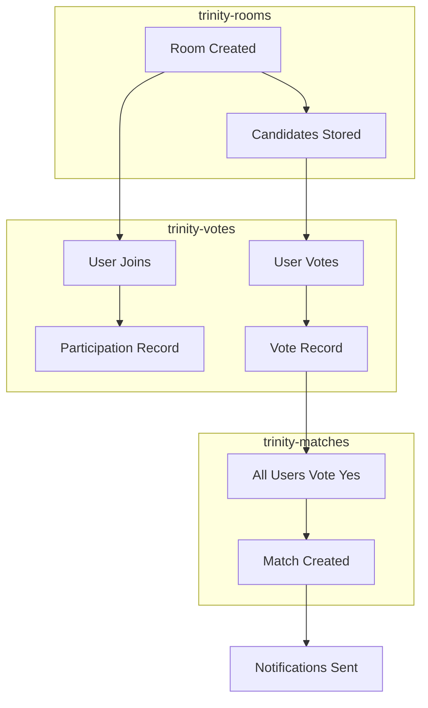

# Trinity - Tablas DynamoDB Detalladas

## 🗄️ ¿Qué es Amazon DynamoDB?

Amazon DynamoDB es una base de datos NoSQL completamente gestionada que proporciona rendimiento rápido y predecible con escalabilidad automática. A diferencia de las bases de datos relacionales tradicionales, DynamoDB está optimizada para aplicaciones que requieren latencia baja y escalabilidad masiva.

### Conceptos Fundamentales de DynamoDB

#### Modelo de Datos NoSQL
```
Tabla → Items (filas) → Atributos (columnas)
```

#### Claves Primarias
- **Partition Key (PK)**: Distribuye datos entre múltiples particiones
- **Sort Key (SK)**: Ordena items dentro de una partición
- **Composite Key**: PK + SK para identificación única

#### Índices Secundarios Globales (GSI)
Permiten consultas eficientes por atributos diferentes a la clave primaria.

### Ventajas para Trinity
- **Latencia Ultra-baja**: < 10ms para operaciones simples
- **Escalabilidad Automática**: De cero a millones de requests
- **Serverless**: No hay servidores que gestionar
- **Integración AWS**: Funciona perfectamente con Lambda y AppSync

## 📊 Diseño de Tablas Trinity

Trinity utiliza **3 tablas principales** diseñadas siguiendo las mejores prácticas de modelado NoSQL:

### Principios de Diseño Aplicados
1. **Single Table Design**: Minimizar número de tablas
2. **Access Patterns First**: Diseñar basado en cómo se accederán los datos
3. **Denormalización**: Duplicar datos para optimizar consultas
4. **Hot Partitions**: Evitar concentración de tráfico

## 🏠 Tabla: trinity-rooms

### Propósito
Almacena información de las salas de votación, incluyendo configuración, candidatos de películas y metadatos de expiración.

### Estructura de Claves
```typescript
interface RoomKey {
  id: string;           // Partition Key - UUID único
}
```

### Esquema Completo
```typescript
interface RoomItem {
  // Claves primarias
  id: string;                    // PK: UUID único de la sala
  
  // Atributos de búsqueda
  code: string;                  // Código de 6 caracteres (GSI)
  
  // Metadatos de sala
  hostId: string;                // ID del usuario creador
  mediaType: 'MOVIE' | 'TV';     // Tipo de contenido
  genreIds: number[];            // IDs de géneros TMDB (máx 2)
  
  // Datos de películas
  candidates: MovieCandidate[];   // Lista de candidatos
  
  // Timestamps y TTL
  createdAt: string;             // ISO timestamp de creación
  ttl: number;                   // Unix timestamp para expiración (24h)
}

interface MovieCandidate {
  id: number;                    // ID de TMDB
  title: string;                 // Título de la película
  overview: string;              // Sinopsis
  posterPath?: string;           // URL del poster
  releaseDate: string;           // Fecha de estreno
  mediaType: 'MOVIE' | 'TV';     // Tipo de media
}
```

### Índices Secundarios Globales (GSI)

#### code-index
```typescript
interface CodeIndexKey {
  code: string;         // GSI Partition Key
  // No Sort Key necesario
}
```

**Propósito**: Permitir búsqueda rápida de salas por código de 6 caracteres.

**Casos de Uso**:
- Unirse a sala con código
- Validar unicidad de códigos

### Patrones de Acceso

#### 1. Obtener Sala por ID
```typescript
// Acceso directo por Partition Key
const params = {
  TableName: 'trinity-rooms',
  Key: { id: 'room-uuid-123' }
};
```

#### 2. Buscar Sala por Código
```typescript
// Query usando GSI
const params = {
  TableName: 'trinity-rooms',
  IndexName: 'code-index',
  KeyConditionExpression: 'code = :code',
  ExpressionAttributeValues: {
    ':code': 'ABC123'
  }
};
```

#### 3. Obtener Salas por Host
```typescript
// Scan con filtro (menos eficiente, pero necesario)
const params = {
  TableName: 'trinity-rooms',
  FilterExpression: 'hostId = :hostId',
  ExpressionAttributeValues: {
    ':hostId': 'user-123'
  }
};
```

### Time To Live (TTL)
```typescript
// Configuración automática de expiración
const ttl = Math.floor(Date.now() / 1000) + (24 * 60 * 60); // 24 horas

const room = {
  id: 'room-123',
  // ... otros campos
  ttl: ttl  // DynamoDB eliminará automáticamente después de este timestamp
};
```

### Diagrama de Estructura
```mermaid
erDiagram
    ROOMS {
        string id PK
        string code GSI
        string hostId
        string mediaType
        number[] genreIds
        object[] candidates
        string createdAt
        number ttl
    }
    
    CANDIDATES {
        number id
        string title
        string overview
        string posterPath
        string releaseDate
        string mediaType
    }
    
    ROOMS ||--o{ CANDIDATES : contains
```

## 🗳️ Tabla: trinity-votes

### Propósito
Registra todos los votos individuales de usuarios por películas específicas, incluyendo registros de participación en salas.

### Estructura de Claves
```typescript
interface VoteKey {
  roomId: string;           // Partition Key
  userMovieId: string;      // Sort Key: formato "userId#movieId"
}
```

### Esquema Completo
```typescript
interface VoteItem {
  // Claves primarias
  roomId: string;              // PK: ID de la sala
  userMovieId: string;         // SK: "userId#movieId" o "userId#JOINED"
  
  // Datos del voto
  userId: string;              // ID del usuario
  movieId: number;             // ID de TMDB (-1 para participación)
  vote: boolean;               // true = positivo, false = negativo
  
  // Metadatos
  timestamp: string;           // ISO timestamp del voto
  isParticipation?: boolean;   // Flag para registros de participación
}
```

### Patrones de Acceso

#### 1. Obtener Todos los Votos de una Sala
```typescript
// Query por Partition Key
const params = {
  TableName: 'trinity-votes',
  KeyConditionExpression: 'roomId = :roomId',
  ExpressionAttributeValues: {
    ':roomId': 'room-123'
  }
};
```

#### 2. Obtener Voto Específico
```typescript
// Get item con clave completa
const params = {
  TableName: 'trinity-votes',
  Key: {
    roomId: 'room-123',
    userMovieId: 'user-456#789'  // userId#movieId
  }
};
```

#### 3. Obtener Votos de Usuario en Sala
```typescript
// Query con begins_with en Sort Key
const params = {
  TableName: 'trinity-votes',
  KeyConditionExpression: 'roomId = :roomId AND begins_with(userMovieId, :userId)',
  ExpressionAttributeValues: {
    ':roomId': 'room-123',
    ':userId': 'user-456#'
  }
};
```

#### 4. Obtener Participación de Usuario (Todas las Salas)
```typescript
// Scan con filtro por userId
const params = {
  TableName: 'trinity-votes',
  FilterExpression: 'userId = :userId',
  ExpressionAttributeValues: {
    ':userId': 'user-456'
  }
};
```

### Tipos de Registros

#### Voto Real
```typescript
{
  roomId: 'room-123',
  userMovieId: 'user-456#789',
  userId: 'user-456',
  movieId: 789,
  vote: true,
  timestamp: '2026-02-03T12:00:00Z'
}
```

#### Registro de Participación
```typescript
{
  roomId: 'room-123',
  userMovieId: 'user-456#JOINED',
  userId: 'user-456',
  movieId: -1,                    // Valor especial
  vote: false,                    // No es un voto real
  timestamp: '2026-02-03T11:30:00Z',
  isParticipation: true           // Flag identificador
}
```

### Diagrama de Estructura
```mermaid
erDiagram
    VOTES {
        string roomId PK
        string userMovieId SK
        string userId
        number movieId
        boolean vote
        string timestamp
        boolean isParticipation
    }
    
    ROOMS ||--o{ VOTES : "users vote in"
```

## 🎯 Tabla: trinity-matches

### Propósito
Almacena los matches encontrados cuando todos los usuarios de una sala votan positivamente por la misma película.

### Estructura de Claves
```typescript
interface MatchKey {
  roomId: string;       // Partition Key
  movieId: number;      // Sort Key
}
```

### Esquema Completo
```typescript
interface MatchItem {
  // Claves primarias
  roomId: string;              // PK: ID de la sala donde ocurrió
  movieId: number;             // SK: ID de TMDB de la película
  
  // Identificación única
  matchId: string;             // UUID único del match
  
  // Datos de la película
  title: string;               // Título de la película
  posterPath?: string;         // URL del poster
  
  // Datos del match
  matchedUsers: string[];      // Array de IDs de usuarios
  timestamp: string;           // ISO timestamp del match
}
```

### Patrones de Acceso

#### 1. Obtener Matches de una Sala
```typescript
// Query por Partition Key
const params = {
  TableName: 'trinity-matches',
  KeyConditionExpression: 'roomId = :roomId',
  ExpressionAttributeValues: {
    ':roomId': 'room-123'
  }
};
```

#### 2. Verificar Match Específico
```typescript
// Get item con clave completa
const params = {
  TableName: 'trinity-matches',
  Key: {
    roomId: 'room-123',
    movieId: 789
  }
};
```

#### 3. Obtener Matches de Usuario (Todas las Salas)
```typescript
// Scan con filtro contains
const params = {
  TableName: 'trinity-matches',
  FilterExpression: 'contains(matchedUsers, :userId)',
  ExpressionAttributeValues: {
    ':userId': 'user-456'
  }
};
```

### Optimización Futura: GSI por Usuario
```typescript
// GSI propuesto para optimizar consultas por usuario
interface UserMatchesGSI {
  userId: string;           // GSI PK (extraído de matchedUsers)
  timestamp: string;        // GSI SK para ordenamiento
  roomId: string;           // Atributo proyectado
  movieId: number;          // Atributo proyectado
}
```

### Diagrama de Estructura
```mermaid
erDiagram
    MATCHES {
        string roomId PK
        number movieId SK
        string matchId
        string title
        string posterPath
        string[] matchedUsers
        string timestamp
    }
    
    ROOMS ||--o{ MATCHES : "generates"
    VOTES ||--o{ MATCHES : "creates when unanimous"
```

## 🔄 Relaciones entre Tablas

### Flujo de Datos Completo


### Consultas Cross-Table

#### Obtener Salas del Usuario (Sin Matches)
```typescript
async function getMyRoomsWithoutMatches(userId: string): Promise<Room[]> {
  // 1. Obtener salas donde es host
  const hostRooms = await scanRoomsByHost(userId);
  
  // 2. Obtener salas donde ha participado
  const participatedRooms = await getRoomsFromVotes(userId);
  
  // 3. Combinar y deduplicar
  const allRooms = [...hostRooms, ...participatedRooms];
  const uniqueRooms = deduplicateById(allRooms);
  
  // 4. Filtrar salas con matches
  const roomsWithoutMatches = [];
  for (const room of uniqueRooms) {
    const hasMatches = await checkRoomHasMatches(room.id);
    if (!hasMatches) {
      roomsWithoutMatches.push(room);
    }
  }
  
  return roomsWithoutMatches;
}
```

## 📊 Optimizaciones de Performance

### Estrategias de Particionamiento

#### Hot Partition Avoidance
```typescript
// ❌ Mal diseño - concentra tráfico
interface BadDesign {
  date: string;        // PK: "2026-02-03" - todos los votos del día
  userId: string;      // SK: distribuye mal
}

// ✅ Buen diseño - distribuye tráfico
interface GoodDesign {
  roomId: string;      // PK: distribuye por sala
  userMovieId: string; // SK: distribuye por usuario+película
}
```

#### Composite Keys Eficientes
```typescript
// Formato optimizado para Sort Key
const userMovieId = `${userId}#${movieId}`;  // "user-123#789"

// Permite queries eficientes:
// - Todos los votos de un usuario: begins_with("user-123#")
// - Voto específico: exact match "user-123#789"
```

### Batch Operations
```typescript
// Escribir múltiples votos eficientemente
const batchWrite = {
  RequestItems: {
    'trinity-votes': [
      {
        PutRequest: {
          Item: vote1
        }
      },
      {
        PutRequest: {
          Item: vote2
        }
      }
    ]
  }
};

await dynamodb.batchWrite(batchWrite).promise();
```

### Read/Write Capacity Planning
```typescript
// Configuración de capacidad
const table = new dynamodb.Table(this, 'VotesTable', {
  billingMode: dynamodb.BillingMode.PAY_PER_REQUEST,  // On-demand
  // O para tráfico predecible:
  // billingMode: dynamodb.BillingMode.PROVISIONED,
  // readCapacity: 5,
  // writeCapacity: 5,
});
```

## 🔍 Monitoreo y Métricas

### Métricas Clave de DynamoDB
- **ConsumedReadCapacityUnits**: Capacidad de lectura utilizada
- **ConsumedWriteCapacityUnits**: Capacidad de escritura utilizada
- **ThrottledRequests**: Requests limitados por capacidad
- **ItemCount**: Número de items en tabla
- **TableSizeBytes**: Tamaño total de la tabla

### CloudWatch Alarms
```typescript
// Alarm para throttling
new cloudwatch.Alarm(this, 'VotesTableThrottleAlarm', {
  metric: votesTable.metricThrottledRequestsForOperations({
    operations: [dynamodb.Operation.PUT_ITEM, dynamodb.Operation.QUERY]
  }),
  threshold: 5,
  evaluationPeriods: 2,
});
```

## 🧪 Testing de Tablas

### Unit Tests para Operaciones
```typescript
describe('VotesTable Operations', () => {
  it('should store vote correctly', async () => {
    const vote = {
      roomId: 'test-room',
      userMovieId: 'user-123#789',
      userId: 'user-123',
      movieId: 789,
      vote: true,
      timestamp: new Date().toISOString()
    };
    
    await votesTable.put(vote);
    
    const retrieved = await votesTable.get({
      roomId: 'test-room',
      userMovieId: 'user-123#789'
    });
    
    expect(retrieved).toMatchObject(vote);
  });
});
```

### Integration Tests
```typescript
describe('Cross-Table Operations', () => {
  it('should create match when all users vote positively', async () => {
    // Setup: Create room with 2 users
    await createTestRoom('room-123', ['user-1', 'user-2']);
    
    // Action: Both users vote positively for same movie
    await voteForMovie('room-123', 'user-1', 789, true);
    await voteForMovie('room-123', 'user-2', 789, true);
    
    // Assert: Match should be created
    const match = await getMatch('room-123', 789);
    expect(match).toBeDefined();
    expect(match.matchedUsers).toEqual(['user-1', 'user-2']);
  });
});
```

---

Este diseño de tablas DynamoDB proporciona a Trinity una base de datos escalable, eficiente y optimizada para los patrones de acceso específicos de la aplicación, garantizando performance consistente desde pocos usuarios hasta millones.