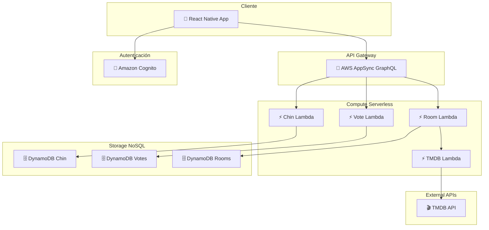
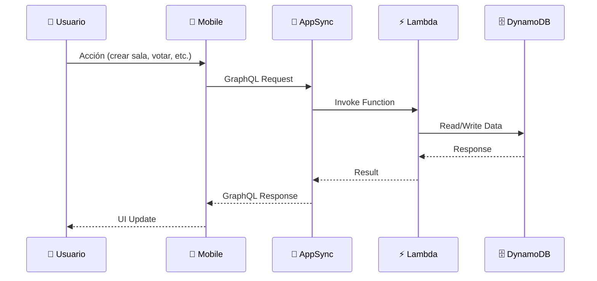

# Trinity - Documentación Técnica Completa

## 📚 Índice de Documentación

Esta carpeta contiene la documentación técnica completa de Trinity Movie Chining App, una aplicación serverless construida con AWS y React Native.

### 📖 Documentos Disponibles

#### [01. Arquitectura de la Aplicación](01-app-architecture.md)
**¿En qué consiste Trinity y cómo está construida?**
- Concepto y funcionamiento de la aplicación
- Arquitectura serverless event-driven
- Ventajas frente a servidores tradicionales
- Principios arquitectónicos y beneficios
- Métricas de rendimiento y escalabilidad

#### [02. Lenguajes de Programación](02-programming-languages.md)
**Stack tecnológico y herramientas de desarrollo**
- TypeScript en frontend, backend e infrastructure
- React Native + Expo para desarrollo móvil
- AWS CDK para Infrastructure as Code
- GraphQL para APIs flexibles
- Herramientas de testing y calidad de código

#### [03. Servicios AWS](03-aws-services.md)
**Servicios AWS utilizados y su propósito**
- AWS Lambda: Compute serverless
- Amazon DynamoDB: Base de datos NoSQL
- AWS AppSync: API GraphQL gestionada
- Amazon Cognito: Autenticación y autorización
- AWS CDK: Infrastructure as Code
- Servicios adicionales y monitoreo

#### [04. Funciones Lambda](04-lambda-functions.md)
**Microservicios Lambda especializados**
- TMDB Handler: Integración con API externa
- Room Handler: Gestión de salas de votación
- Vote Handler: Procesamiento de votos y chines
- Chin Handler: Gestión de historial de chines
- Interconexión y optimizaciones

#### [05. Esquemas GraphQL](05-graphql-schema.md)
**API GraphQL completa y tipada**
- Tipos base: Room, Chin, Vote, MovieCandidate
- Queries: Consultas de datos
- Mutations: Modificación de datos
- Subscriptions: Notificaciones en tiempo real
- Directivas de autorización y seguridad

#### [06. Tablas DynamoDB](06-dynamodb-tables.md)
**Diseño de base de datos NoSQL optimizada**
- trinity-rooms: Salas de votación
- trinity-votes: Votos y participación
- trinity-chines: Chin encontrados
- Patrones de acceso y optimizaciones
- Índices secundarios y performance

#### [07. Flujos de Aplicación](07-application-flows.md)
**Flujos detallados de funcionalidades**
- Creación de sala con TMDB
- Unirse a sala con código
- Proceso de votación y detección de chines
- Sistema de notificaciones en tiempo real
- Consulta de salas y chines del usuario

## 🎯 Cómo Usar Esta Documentación

### Para Desarrolladores Nuevos
1. Comienza con [Arquitectura de la Aplicación](01-app-architecture.md) para entender el concepto general
2. Revisa [Lenguajes de Programación](02-programming-languages.md) para conocer el stack tecnológico
3. Estudia [Servicios AWS](03-aws-services.md) para comprender la infraestructura

### Para Desarrollo Backend
1. [Funciones Lambda](04-lambda-functions.md) - Microservicios y lógica de negocio
2. [Tablas DynamoDB](06-dynamodb-tables.md) - Diseño de base de datos
3. [Esquemas GraphQL](05-graphql-schema.md) - API y contratos de datos

### Para Desarrollo Frontend
1. [Esquemas GraphQL](05-graphql-schema.md) - API disponible
2. [Flujos de Aplicación](07-application-flows.md) - Interacciones usuario-sistema
3. [Lenguajes de Programación](02-programming-languages.md) - Stack móvil

### Para DevOps/Infrastructure
1. [Servicios AWS](03-aws-services.md) - Recursos y configuración
2. [Arquitectura de la Aplicación](01-app-architecture.md) - Principios y escalabilidad
3. [Funciones Lambda](04-lambda-functions.md) - Deployment y monitoreo

## 🔧 Conceptos Clave

### Serverless Event-Driven
Trinity está construida siguiendo una arquitectura completamente serverless donde:
- **No hay servidores que mantener**: AWS gestiona toda la infraestructura
- **Escalabilidad automática**: De 0 a millones de usuarios sin configuración
- **Pago por uso**: Solo pagas por recursos realmente utilizados
- **Event-driven**: Cada acción del usuario dispara eventos que procesan los datos

### Microservicios Lambda
Cada función Lambda es un microservicio independiente:
```
📱 Usuario Acción → 🔗 AppSync → ⚡ Lambda → 🗄️ DynamoDB → 📡 Notificación
```

### Real-time con GraphQL
- **Subscriptions**: Notificaciones instantáneas via WebSocket
- **Polling Fallback**: Sistema de respaldo para garantizar entrega
- **Typed API**: Contratos de datos claros y validados

## 📊 Diagramas de Arquitectura

### Arquitectura General


### Flujo de Datos Principal


## 🚀 Beneficios de la Arquitectura

### Escalabilidad
- **Automática**: Sin configuración manual
- **Granular**: Cada función escala independientemente
- **Ilimitada**: Maneja desde 1 hasta millones de usuarios

### Costo-Efectividad
- **Pay-per-use**: Solo pagas por ejecuciones reales
- **No overhead**: Sin servidores idle consumiendo recursos
- **Optimizado**: ~90% menos costo que arquitecturas tradicionales

### Mantenibilidad
- **Microservicios**: Cada función tiene responsabilidad específica
- **Desacoplado**: Cambios aislados no afectan otros componentes
- **Versionado**: Deploy independiente de cada función

### Confiabilidad
- **Fault Tolerance**: Fallos aislados por función
- **Auto-retry**: Reintentos automáticos en errores
- **Multi-AZ**: Distribuido en múltiples zonas de disponibilidad

## 📈 Métricas y KPIs

### Performance
- **Latencia API**: < 200ms promedio
- **Cold Start**: < 1s para funciones Lambda
- **Throughput**: 1000+ requests/segundo por función

### Disponibilidad
- **SLA Target**: 99.9% uptime
- **Error Rate**: < 0.1% de requests
- **Recovery Time**: < 5 minutos para incidentes

### Costos
- **Baseline**: $5-10/mes para 1000 usuarios activos
- **Scaling**: Costo lineal con uso real
- **Efficiency**: 90% ahorro vs arquitectura tradicional

## 🔍 Próximos Pasos

### Para Implementar
1. **Setup AWS Account**: Configurar cuenta y permisos
2. **Deploy Infrastructure**: `cdk deploy` en directorio infrastructure
3. **Configure Mobile**: Actualizar variables de entorno
4. **Test End-to-End**: Verificar flujos completos

### Para Extender
1. **Machine Learning**: Recomendaciones personalizadas
2. **Multi-región**: Deploy en múltiples regiones AWS
3. **Analytics**: Dashboards de uso y métricas
4. **Social Features**: Perfiles y conexiones entre usuarios

---

Esta documentación técnica proporciona una comprensión completa de Trinity, desde conceptos de alto nivel hasta detalles de implementación específicos. Cada documento está diseñado para ser independiente pero complementario con los demás.