# Trinity - Diagramas de Arquitectura

## 🏗️ Diagrama de Arquitectura Completa

### Vista General del Sistema
```mermaid
graph TB
    subgraph "🌐 Internet"
        EXT[External Users]
    end
    
    subgraph "📱 Client Layer"
        RN[React Native App<br/>TypeScript + Expo]
        WEB[Web Interface<br/>(Future)]
    end
    
    subgraph "🔐 Authentication Layer"
        COG[Amazon Cognito<br/>User Pool + Identity Pool]
    end
    
    subgraph "🔗 API Layer"
        AS[AWS AppSync<br/>GraphQL API]
        subgraph "GraphQL Operations"
            Q[Queries<br/>getMyRooms, getMyChin]
            M[Mutations<br/>createRoom, vote, joinRoom]
            S[Subscriptions<br/>userChin, roomChin]
        end
    end
    
    subgraph "⚡ Compute Layer"
        subgraph "Lambda Functions"
            RH[Room Handler<br/>Gestión de Salas]
            VH[Vote Handler<br/>Procesamiento Votos]
            MH[Chin Handler<br/>Gestión Chin]
            TH[TMDB Handler<br/>API Externa]
        end
    end
    
    subgraph "🗄️ Storage Layer"
        subgraph "DynamoDB Tables"
            RT[trinity-rooms<br/>Salas + Candidatos]
            VT[trinity-votes<br/>Votos + Participación]
            MT[trinity-chines<br/>Chin Encontrados]
        end
    end
    
    subgraph "🎬 External APIs"
        TMDB[The Movie Database<br/>API v3]
    end
    
    subgraph "📊 Monitoring Layer"
        CW[CloudWatch<br/>Logs + Metrics]
        XR[X-Ray<br/>Distributed Tracing]
    end
    
    %% Connections
    EXT --> RN
    EXT --> WEB
    RN --> COG
    RN --> AS
    WEB --> COG
    WEB --> AS
    
    AS --> Q
    AS --> M
    AS --> S
    
    Q --> RH
    Q --> MH
    M --> RH
    M --> VH
    S --> VH
    S --> MH
    
    RH --> TH
    RH --> RT
    RH --> VT
    VH --> VT
    VH --> MT
    VH --> RT
    MH --> MT
    TH --> TMDB
    
    RH --> CW
    VH --> CW
    MH --> CW
    TH --> CW
    
    RH --> XR
    VH --> XR
    MH --> XR
    TH --> XR
    
    %% Styling
    classDef client fill:#e1f5fe
    classDef auth fill:#f3e5f5
    classDef api fill:#e8f5e8
    classDef compute fill:#fff3e0
    classDef storage fill:#fce4ec
    classDef external fill:#f1f8e9
    classDef monitoring fill:#e0f2f1
    
    class RN,WEB client
    class COG auth
    class AS,Q,M,S api
    class RH,VH,MH,TH compute
    class RT,VT,MT storage
    class TMDB external
    class CW,XR monitoring
```

## 🔄 Diagrama de Flujo de Datos

### Flujo Principal: Crear Sala → Votar → Chin

```mermaid
flowchart TD
    A[👤 Usuario inicia app] --> B{🔐 Autenticado?}
    B -->|No| C[🔑 Login con Cognito]
    B -->|Sí| D[📱 Dashboard]
    C --> D
    
    D --> E{Acción del usuario}
    
    E -->|Crear Sala| F[📝 Seleccionar géneros]
    F --> G[🔗 createRoom GraphQL]
    G --> H[⚡ Room Handler]
    H --> I[🎬 Obtener películas TMDB]
    I --> J[🗄️ Guardar en DynamoDB]
    J --> K[📋 Mostrar código sala]
    
    E -->|Unirse| L[🔢 Ingresar código]
    L --> M[🔗 joinRoom GraphQL]
    M --> N[⚡ Room Handler]
    N --> O[🔍 Buscar sala por código]
    O --> P{Sala válida?}
    P -->|No| Q[❌ Error: Sala no encontrada]
    P -->|Sí| R[✅ Unirse a sala]
    
    K --> S[🗳️ Pantalla de votación]
    R --> S
    
    S --> T[👍👎 Usuario vota]
    T --> U[🔗 vote GraphQL]
    U --> V[⚡ Vote Handler]
    V --> W[💾 Guardar voto]
    W --> X{Todos votaron positivo?}
    
    X -->|No| Y[⏳ Esperar más votos]
    X -->|Sí| Z[🎉 MATCH ENCONTRADO!]
    
    Z --> AA[💾 Crear registro chin]
    AA --> AB[📡 Publicar notificación]
    AB --> AC[📱 Notificar usuarios]
    AC --> AD[🎬 Mostrar película ganadora]
    
    Y --> S
    
    %% Styling
    classDef user fill:#e3f2fd
    classDef auth fill:#f3e5f5
    classDef action fill:#e8f5e8
    classDef process fill:#fff3e0
    classDef storage fill:#fce4ec
    classDef success fill:#e8f5e8
    classDef error fill:#ffebee
    
    class A,T user
    class B,C auth
    class D,E,F,L,S action
    class G,H,I,M,N,U,V,W process
    class J,O,AA storage
    class K,R,Z,AD success
    class Q error
```


## 🏢 Diagrama de Componentes por Capas

### Separación de Responsabilidades

```mermaid
graph TB
    subgraph "🎨 Presentation Layer"
        subgraph "📱 Mobile App (React Native)"
            SC[Screens<br/>Auth, Dashboard, Voting]
            CP[Components<br/>VotingCard, RoomList]
            NV[Navigation<br/>Stack Navigator]
        end
    end
    
    subgraph "🔄 Business Logic Layer"
        subgraph "📡 Services"
            AS[Auth Service<br/>Cognito Integration]
            GS[GraphQL Service<br/>Queries & Mutations]
            NS[Notification Service<br/>Subscriptions + Polling]
        end
        
        subgraph "🎣 Custom Hooks"
            UA[useAuth<br/>Authentication State]
            UP[usePolling<br/>Chin Polling]
            UM[useChin<br/>Chin Management]
        end
        
        subgraph "🌍 Context Providers"
            AC[AuthContext<br/>User State]
            MC[ChinContext<br/>Notification State]
        end
    end
    
    subgraph "🔗 API Layer"
        subgraph "🌐 AWS AppSync"
            GQL[GraphQL Schema<br/>Types, Queries, Mutations]
            RES[Resolvers<br/>Lambda Data Sources]
            SUB[Subscriptions<br/>Real-time Events]
        end
    end
    
    subgraph "⚡ Processing Layer"
        subgraph "🔧 Lambda Functions"
            RF[Room Function<br/>CRUD Operations]
            VF[Vote Function<br/>Vote Processing]
            MF[Chin Function<br/>Chin Queries]
            TF[TMDB Function<br/>External API]
        end
    end
    
    subgraph "💾 Data Layer"
        subgraph "🗄️ DynamoDB"
            RDB[(Rooms Table<br/>Salas + Candidatos)]
            VDB[(Votes Table<br/>Votos + Participación)]
            MDB[(Chin Table<br/>Chin Encontrados)]
        end
        
        subgraph "🌐 External"
            TMDB[(TMDB API<br/>Movie Database)]
        end
    end
    
    %% Connections between layers
    SC --> AS
    SC --> GS
    SC --> NS
    CP --> UA
    CP --> UP
    CP --> UM
    
    AS --> AC
    GS --> GQL
    NS --> SUB
    UA --> AC
    UP --> MC
    UM --> MC
    
    GQL --> RES
    RES --> RF
    RES --> VF
    RES --> MF
    SUB --> VF
    SUB --> MF
    
    RF --> RDB
    RF --> VDB
    RF --> TF
    VF --> VDB
    VF --> MDB
    MF --> MDB
    TF --> TMDB
    
    %% Styling
    classDef presentation fill:#e3f2fd
    classDef business fill:#f3e5f5
    classDef api fill:#e8f5e8
    classDef processing fill:#fff3e0
    classDef data fill:#fce4ec
    
    class SC,CP,NV presentation
    class AS,GS,NS,UA,UP,UM,AC,MC business
    class GQL,RES,SUB api
    class RF,VF,MF,TF processing
    class RDB,VDB,MDB,TMDB data
```


## 🔄 Diagrama de Estados de Sala

### Ciclo de Vida de una Sala

```mermaid
stateDiagram-v2
    [*] --> Creating: Usuario crea sala
    
    Creating --> Fetching_Movies: Validar input
    Fetching_Movies --> Generating_Code: Obtener candidatos TMDB
    Generating_Code --> Storing_Room: Generar código único
    Storing_Room --> Active: Guardar en DynamoDB
    
    Active --> Waiting_Users: Sala creada
    Waiting_Users --> Voting: Usuarios se unen
    
    Voting --> Voting: Más votos necesarios
    Voting --> Chin_Found: Todos votan positivo
    Voting --> No_Chin: Votos negativos/mixtos
    
    No_Chin --> Voting: Continuar votando
    Chin_Found --> Completed: Notificar usuarios
    
    Active --> Expired: TTL alcanzado (24h)
    Waiting_Users --> Expired: TTL alcanzado
    Voting --> Expired: TTL alcanzado
    No_Chin --> Expired: TTL alcanzado
    
    Completed --> [*]: Sala archivada
    Expired --> [*]: Sala eliminada
    
    note right of Creating
        Room Handler
        + TMDB Handler
    end note
    
    note right of Voting
        Vote Handler
        verifica chines
    end note
    
    note right of Chin_Found
        Chin Handler
        + Notifications
    end note
```


## 📊 Diagrama de Flujo de Notificaciones

### Sistema de Notificaciones en Tiempo Real

```mermaid
sequenceDiagram
    participant U1 as 👤 Usuario 1
    participant U2 as 👤 Usuario 2
    participant APP as 📱 Mobile App
    participant AS as 🔗 AppSync
    participant VH as ⚡ Vote Handler
    participant SUB as 📡 Subscription Manager
    
    Note over U1,U2: Ambos usuarios en la misma sala
    
    %% Suscripción inicial
    APP->>AS: Subscribe to userChin
    AS->>SUB: Register subscription
    
    %% Primer voto
    U1->>APP: Vota positivo por película X
    APP->>AS: vote mutation
    AS->>VH: Process vote
    VH->>VH: Store vote + Check chin
    Note over VH: 1 de 2 usuarios - No chin aún
    VH-->>AS: Vote recorded
    AS-->>APP: Success response
    
    %% Segundo voto que genera chin
    U2->>APP: Vota positivo por película X
    APP->>AS: vote mutation
    AS->>VH: Process vote
    VH->>VH: Store vote + Check chin
    Note over VH: 2 de 2 usuarios - MATCH!
    
    %% Publicar notificaciones
    VH->>AS: publishUserChin(user1)
    VH->>AS: publishUserChin(user2)
    
    %% Entregar notificaciones
    AS->>SUB: Broadcast chin events
    SUB-->>APP: Chin notification (user1)
    SUB-->>APP: Chin notification (user2)
    
    %% Actualizar UI
    APP-->>U1: 🎉 Chin encontrado!
    APP-->>U2: 🎉 Chin encontrado!
    
    %% Fallback polling (si subscription falla)
    alt Subscription Error
        APP->>AS: checkUserChin (polling)
        AS-->>APP: Recent chines
        APP-->>U1: 🎉 Chin (delayed)
        APP-->>U2: 🎉 Chin (delayed)
    end
```


## 🗄️ Diagrama de Modelo de Datos

### Relaciones entre Tablas DynamoDB
```mermaid
erDiagram
    ROOMS {
        string id PK
        string code GSI
        string hostId
        string mediaType
        number[] genreIds
        object[] candidates
        string createdAt
        number ttl
    }
    
    VOTES {
        string roomId PK
        string userMovieId SK
        string userId
        number movieId
        boolean vote
        string timestamp
        boolean isParticipation
    }
    
    MATCHES {
        string roomId PK
        number movieId SK
        string chinId
        string title
        string posterPath
        string[] chinedUsers
        string timestamp
    }
    
    USERS {
        string id
        string email
        string name
        string createdAt
    }
    
    %% Relationships
    ROOMS ||--o{ VOTES : "users vote in rooms"
    ROOMS ||--o{ MATCHES : "rooms generate chines"
    VOTES ||--o{ MATCHES : "unanimous votes create chines"
    USERS ||--o{ ROOMS : "users create rooms"
    USERS ||--o{ VOTES : "users cast votes"
    USERS ||--o{ MATCHES : "users participate in chines"
    
    %% Notes
    ROOMS }|--|| TMDB_API : "fetches candidates"
    VOTES }|--|| PARTICIPATION : "tracks room membership"
    MATCHES }|--|| NOTIFICATIONS : "triggers real-time events"
```

## ⚡ Diagrama de Performance y Escalabilidad

### Métricas de Rendimiento por Componente


---

Estos diagramas proporcionan una vista visual completa de la arquitectura Trinity, desde la perspectiva de alto nivel hasta los detalles de implementación y performance, facilitando la comprensión del sistema para desarrolladores, arquitectos y stakeholders.