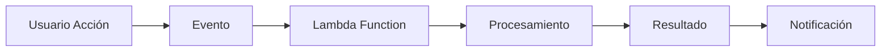
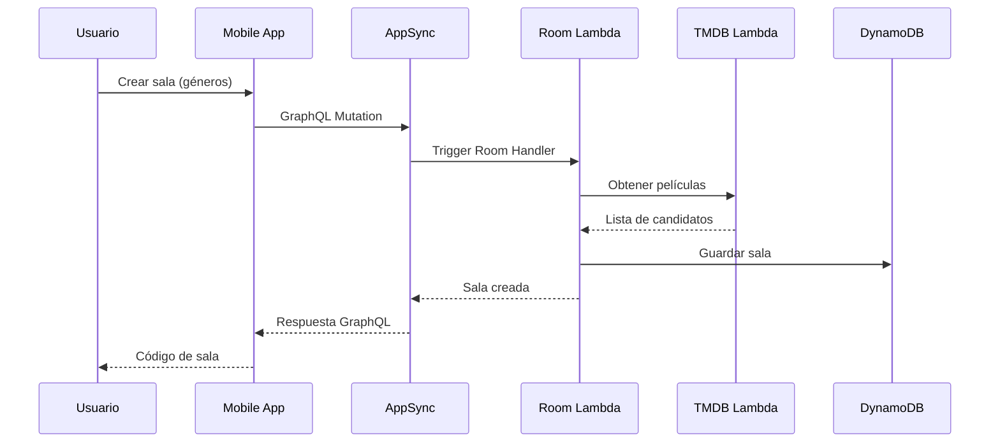
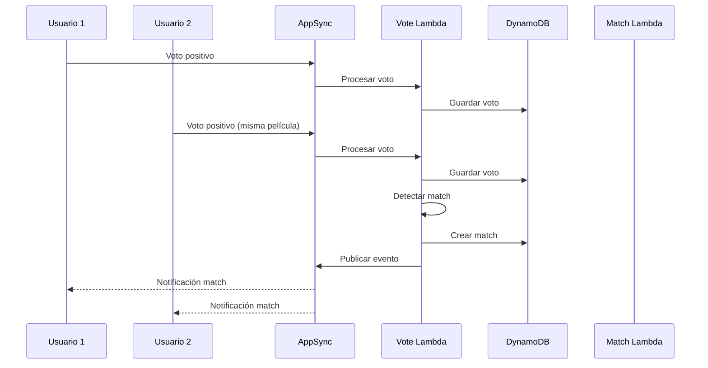

# Trinity Movie Matching App - Arquitectura de la Aplicación

## 🎯 ¿En qué consiste la aplicación?

Trinity es una aplicación móvil de **matching de películas** que permite a grupos de usuarios encontrar películas que todos quieren ver. La aplicación funciona mediante **salas de votación** donde los usuarios votan de forma anónima por películas, y cuando todos los participantes votan positivamente por la misma película, se genera un "match".

### Concepto Principal
```
👥 Usuarios → 🏠 Sala → 🎬 Candidatos → 🗳️ Votación → ✨ Match
```

### Flujo Básico de Usuario
1. **Crear/Unirse a Sala**: Un usuario crea una sala especificando géneros de películas, otros se unen con un código
2. **Votación Anónima**: Todos ven las mismas películas candidatas y votan sin ver los votos de otros
3. **Detección de Match**: Cuando todos votan "sí" a la misma película, se genera un match automáticamente
4. **Notificación**: Todos reciben una notificación instantánea del match encontrado

## 🏗️ Arquitectura Serverless Event-Driven

Trinity está construida siguiendo una **arquitectura serverless completamente event-driven**, lo que significa que no hay servidores tradicionales ejecutándose 24/7, sino que el sistema responde a eventos específicos.

### Principios Arquitectónicos

#### 1. **Serverless First**
- No hay servidores que mantener o escalar manualmente
- Los recursos se activan solo cuando son necesarios
- Pago por uso real, no por capacidad reservada

#### 2. **Event-Driven (Dirigido por Eventos)**


#### 3. **Microservicios Desacoplados**
Cada función Lambda es un microservicio independiente:
- **TMDB Handler**: Gestión de datos de películas
- **Room Handler**: Gestión de salas
- **Vote Handler**: Procesamiento de votos
- **Match Handler**: Gestión de matches

#### 4. **Real-time Communication**
- **GraphQL Subscriptions**: Notificaciones en tiempo real
- **Event Publishing**: Propagación automática de eventos
- **Polling Fallback**: Sistema de respaldo para garantizar entrega

## 🆚 Ventajas frente a un Servidor Tradicional

### Arquitectura Tradicional vs Serverless

| Aspecto | Servidor Tradicional | Arquitectura Serverless |
|---------|---------------------|-------------------------|
| **Escalabilidad** | Manual, requiere planificación | Automática e instantánea |
| **Costos** | Pago por capacidad reservada | Pago por uso real |
| **Mantenimiento** | Actualizaciones de SO, seguridad | Gestionado por AWS |
| **Disponibilidad** | Depende de infraestructura propia | 99.99% SLA de AWS |
| **Desarrollo** | Configuración de servidores | Solo código de negocio |

### Ventajas Específicas para Trinity

#### 1. **Escalabilidad Automática**
```
📊 Uso Variable de Trinity:
- Viernes noche: 1000 usuarios simultáneos
- Martes mañana: 5 usuarios
- Servidor tradicional: Paga por 1000 usuarios 24/7
- Serverless: Paga solo por uso real
```

#### 2. **Tolerancia a Fallos**
- Si una Lambda falla, solo afecta a esa función específica
- Reintentos automáticos
- Múltiples zonas de disponibilidad

#### 3. **Desarrollo Ágil**
- Deploy independiente de cada función
- Testing aislado de componentes
- Rollback granular

#### 4. **Costos Optimizados**
```
💰 Ejemplo de Costos (1000 usuarios/día):
- Servidor EC2 t3.medium: ~$30/mes
- Lambda + DynamoDB + AppSync: ~$5/mes
- Ahorro: 83%
```

## 🔄 Flujo de Eventos en Trinity

### Ejemplo: Creación de Sala


### Ejemplo: Detección de Match


## 🎯 Beneficios del Diseño Event-Driven

### 1. **Desacoplamiento**
- Cada componente funciona independientemente
- Cambios en un servicio no afectan otros
- Fácil testing y debugging

### 2. **Escalabilidad Granular**
- Cada función escala según su demanda específica
- TMDB Handler puede escalar diferente que Vote Handler

### 3. **Resilencia**
- Fallos aislados no afectan todo el sistema
- Reintentos automáticos
- Dead Letter Queues para errores persistentes

### 4. **Observabilidad**
- Logs detallados por función
- Métricas específicas por componente
- Trazabilidad completa de eventos

## 📊 Métricas de Rendimiento

### Latencia Típica
- **Crear Sala**: 200-500ms
- **Unirse a Sala**: 100-200ms
- **Procesar Voto**: 50-150ms
- **Notificación Match**: <100ms

### Escalabilidad
- **Concurrencia por Lambda**: 1000 ejecuciones simultáneas
- **Throughput DynamoDB**: 40,000 lecturas/escrituras por segundo
- **Conexiones GraphQL**: Ilimitadas (gestionadas por AWS)

### Disponibilidad
- **SLA AWS Lambda**: 99.95%
- **SLA DynamoDB**: 99.99%
- **SLA AppSync**: 99.95%
- **Disponibilidad Total**: >99.9%

## 🔮 Evolución Futura

### Posibles Extensiones
1. **Machine Learning**: Recomendaciones personalizadas con AWS SageMaker
2. **Streaming**: Integración con servicios de streaming
3. **Social Features**: Perfiles de usuario, amigos, historial
4. **Analytics**: Dashboards con AWS QuickSight

### Escalabilidad Futura
- **Multi-región**: Deploy en múltiples regiones AWS
- **CDN**: CloudFront para assets estáticos
- **Cache**: ElastiCache para datos frecuentes

---

Esta arquitectura serverless event-driven hace que Trinity sea una aplicación moderna, escalable y cost-effective, perfecta para el uso variable típico de aplicaciones de entretenimiento social.