# Trinity - Servicios AWS Utilizados

## 🏗️ Arquitectura de Servicios AWS

Trinity utiliza un conjunto cuidadosamente seleccionado de servicios AWS que trabajan en conjunto para proporcionar una experiencia serverless completa, escalable y cost-effective.

## ⚡ AWS Lambda - Compute Serverless

### ¿Qué es AWS Lambda?
AWS Lambda es un servicio de computación serverless que ejecuta código en respuesta a eventos sin necesidad de aprovisionar o gestionar servidores.

### Conceptos Fundamentales

#### Function as a Service (FaaS)
```
📦 Función Lambda = Código + Configuración + Triggers
```

#### Modelo de Ejecución

```mermaid
graph LR
    A[Evento] --> B[Lambda Runtime]
    B --> C[Función Handler]
    C --> D[Procesamiento]
    D --> E[Respuesta]
    E --> F[Logs CloudWatch]
```


#### Características Clave
- **Stateless**: Cada ejecución es independiente
- **Event-driven**: Se ejecuta solo cuando es necesario
- **Auto-scaling**: Escala automáticamente de 0 a miles de ejecuciones
- **Pay-per-use**: Solo pagas por el tiempo de ejecución

### Configuración en Trinity
```typescript
// Configuración típica de Lambda en CDK
const roomHandler = new lambda.Function(this, 'RoomHandler', {
  runtime: lambda.Runtime.NODEJS_18_X,    // Runtime Node.js 18
  handler: 'index.handler',               // Función de entrada
  code: lambda.Code.fromAsset('src/handlers/room'),
  timeout: cdk.Duration.seconds(30),      // Timeout máximo
  memorySize: 128,                        // Memoria asignada (MB)
  environment: {                          // Variables de entorno
    ROOMS_TABLE: roomsTable.tableName,
    VOTES_TABLE: votesTable.tableName,
  },
});
```

### Ventajas para Trinity
- **Costo**: Solo paga cuando se ejecuta código
- **Escalabilidad**: Maneja picos de tráfico automáticamente
- **Mantenimiento**: AWS gestiona el runtime y la infraestructura
- **Integración**: Conecta nativamente con otros servicios AWS

## 🗄️ Amazon DynamoDB - Base de Datos NoSQL

### ¿Qué es DynamoDB?
DynamoDB es una base de datos NoSQL completamente gestionada que proporciona rendimiento rápido y predecible con escalabilidad automática.

### Conceptos Fundamentales

#### Modelo de Datos
```
📊 Tabla → Items → Atributos
```

#### Claves Primarias
- **Partition Key (PK)**: Distribuye datos entre particiones
- **Sort Key (SK)**: Ordena items dentro de una partición

#### Índices Secundarios Globales (GSI)
Permiten consultas por atributos diferentes a la clave primaria.

### Diseño de Tablas en Trinity

#### Tabla: trinity-rooms
```typescript
interface RoomItem {
  id: string;           // Partition Key
  code: string;         // GSI Partition Key
  hostId: string;
  mediaType: 'MOVIE' | 'TV';
  genreIds: number[];
  candidates: MovieCandidate[];
  createdAt: string;
  ttl: number;          // Time To Live (expiración automática)
}
```

**Patrones de Acceso:**
- Obtener sala por ID: `PK = roomId`
- Buscar sala por código: `GSI code-index`
- Expiración automática: `TTL = 24 horas`

#### Tabla: trinity-votes
```typescript
interface VoteItem {
  roomId: string;       // Partition Key
  userMovieId: string;  // Sort Key (userId#movieId)
  userId: string;
  movieId: number;
  vote: boolean;
  timestamp: string;
}
```

**Patrones de Acceso:**
- Votos de una sala: `PK = roomId`
- Voto específico: `PK = roomId, SK = userId#movieId`
- Participación de usuario: `SK begins_with userId#`

#### Tabla: trinity-matches
```typescript
interface MatchItem {
  roomId: string;       // Partition Key
  movieId: number;      // Sort Key
  matchId: string;
  title: string;
  posterPath?: string;
  matchedUsers: string[];
  timestamp: string;
}
```

### Ventajas de DynamoDB
- **Performance**: Latencia de milisegundos
- **Escalabilidad**: Maneja millones de requests por segundo
- **Disponibilidad**: 99.99% SLA
- **Gestión**: Completamente serverless

## 🔗 AWS AppSync - API GraphQL

### ¿Qué es AppSync?
AWS AppSync es un servicio completamente gestionado que facilita el desarrollo de APIs GraphQL escalables conectando de forma segura a fuentes de datos como DynamoDB, Lambda, y más.

### Conceptos Fundamentales

#### GraphQL Schema
Define la estructura de la API y los tipos de datos disponibles.

```graphql
type Room {
  id: ID!
  code: String!
  hostId: String!
  mediaType: MediaType!
  genreIds: [Int!]!
  candidates: [MovieCandidate!]!
  createdAt: AWSDateTime!
}

type Query {
  getMyRooms: [Room!]!
  getRoom(id: String!): Room
}

type Mutation {
  createRoom(input: CreateRoomInput!): Room!
  vote(input: VoteInput!): VoteResult!
}

type Subscription {
  userMatch(userId: ID!): UserMatchEvent
    @aws_subscribe(mutations: ["publishUserMatch"])
}
```

#### Resolvers
Conectan los campos del schema con las fuentes de datos.

```typescript
// Resolver para getMyRooms
roomDataSource.createResolver('GetMyRoomsResolver', {
  typeName: 'Query',
  fieldName: 'getMyRooms',
  // AppSync invoca automáticamente la Lambda function
});
```

#### Data Sources
- **Lambda Data Source**: Conecta con funciones Lambda
- **DynamoDB Data Source**: Acceso directo a tablas
- **None Data Source**: Para resolvers que no necesitan datos externos

### Características Avanzadas

#### Real-time Subscriptions
```typescript
// Cliente se suscribe a matches
const subscription = client.graphql({
  query: USER_MATCH_SUBSCRIPTION,
  variables: { userId: 'user123' },
}).subscribe({
  next: ({ data }) => {
    console.log('¡Nuevo match!', data.userMatch);
  }
});
```

#### Caching Automático
AppSync cachea automáticamente respuestas para mejorar performance.

#### Batch Operations
Múltiples operaciones en una sola request HTTP.

### Ventajas de AppSync
- **Real-time**: Subscriptions WebSocket nativas
- **Offline**: Sincronización automática cuando vuelve conectividad
- **Seguridad**: Integración con Cognito y IAM
- **Performance**: Caching y optimizaciones automáticas

## 🔐 Amazon Cognito - Autenticación y Autorización

### ¿Qué es Cognito?
Amazon Cognito proporciona autenticación, autorización y gestión de usuarios para aplicaciones web y móviles.

### Componentes Principales

#### User Pool
Directorio de usuarios que proporciona registro, autenticación y gestión de cuentas.

```typescript
const userPool = new cognito.UserPool(this, 'TrinityUserPool', {
  userPoolName: 'trinity-users',
  selfSignUpEnabled: true,
  signInAliases: {
    email: true,  // Login con email
  },
  autoVerify: {
    email: true,  // Verificación automática por email
  },
  passwordPolicy: {
    minLength: 8,
    requireLowercase: true,
    requireUppercase: true,
    requireDigits: true,
    requireSymbols: false,
  },
});
```

#### User Pool Client
Configuración de aplicación para interactuar con el User Pool.

```typescript
const userPoolClient = new cognito.UserPoolClient(this, 'TrinityClient', {
  userPool,
  generateSecret: false,  // Para aplicaciones móviles
  authFlows: {
    userPassword: true,   // Flujo username/password
    userSrp: true,       // Secure Remote Password
  },
});
```

### Flujo de Autenticación


### Tokens JWT
Cognito proporciona tres tipos de tokens:

#### ID Token
```json
{
  "sub": "user-uuid",
  "email": "user@example.com",
  "email_verified": true,
  "aud": "client-id",
  "exp": 1640995200
}
```

#### Access Token
Usado para autorización en AppSync y otros servicios AWS.

#### Refresh Token
Para renovar tokens expirados sin re-autenticación.

### Integración con AppSync
```graphql
# Directivas de autorización
type Query {
  getMyRooms: [Room!]! 
    @aws_auth(cognito_groups: ["Users"])
}

type Mutation {
  createRoom(input: CreateRoomInput!): Room!
    @aws_auth(cognito_groups: ["Users"])
}
```

## 🔧 AWS CDK - Infrastructure as Code

### ¿Qué es CDK?
AWS Cloud Development Kit es un framework de desarrollo de software para definir infraestructura cloud usando lenguajes de programación familiares.

### Conceptos Fundamentales

#### Constructs
Componentes reutilizables que representan recursos AWS.

```typescript
// L1 Construct (bajo nivel)
new CfnTable(this, 'MyTable', {
  tableName: 'my-table',
  attributeDefinitions: [...]
});

// L2 Construct (alto nivel)
new dynamodb.Table(this, 'MyTable', {
  tableName: 'my-table',
  partitionKey: { name: 'id', type: dynamodb.AttributeType.STRING }
});
```

#### Stacks
Unidad de deployment que agrupa recursos relacionados.

```typescript
export class TrinityStack extends cdk.Stack {
  constructor(scope: Construct, id: string, props?: cdk.StackProps) {
    super(scope, id, props);
    
    // Definir recursos
    const table = new dynamodb.Table(this, 'RoomsTable', {...});
    const lambda = new lambda.Function(this, 'RoomHandler', {...});
    
    // Configurar permisos
    table.grantReadWriteData(lambda);
  }
}
```

#### Apps
Contenedor de uno o más stacks.

### Ventajas del CDK
- **Tipado**: Errores detectados en tiempo de compilación
- **Reutilización**: Constructs compartibles
- **Abstracción**: Patrones comunes simplificados
- **Integración**: Mismo lenguaje que la aplicación

## 🌐 Servicios Adicionales

### AWS IAM - Identity and Access Management
Gestiona permisos y accesos de forma granular.

```typescript
// Política para Lambda acceder a DynamoDB
const lambdaRole = new iam.Role(this, 'LambdaRole', {
  assumedBy: new iam.ServicePrincipal('lambda.amazonaws.com'),
  managedPolicies: [
    iam.ManagedPolicy.fromAwsManagedPolicyName('service-role/AWSLambdaBasicExecutionRole')
  ],
});

// Permisos específicos
roomsTable.grantReadWriteData(lambdaRole);
```

### Amazon CloudWatch - Monitoreo y Logs
Recopila y monitorea logs, métricas y eventos.

```typescript
// Logs automáticos de Lambda
console.log(JSON.stringify({
  timestamp: new Date().toISOString(),
  level: 'INFO',
  service: 'room-handler',
  operation: 'createRoom',
  userId: userId,
  success: true
}));
```

### AWS X-Ray - Distributed Tracing
Rastrea requests a través de múltiples servicios.

## 📊 Arquitectura de Servicios Completa


## 💰 Modelo de Costos

### Pricing por Servicio (estimado para 1000 usuarios/mes)

| Servicio | Costo Mensual | Descripción |
|----------|---------------|-------------|
| Lambda | $2-5 | Pay per invocation + duration |
| DynamoDB | $1-3 | Pay per read/write + storage |
| AppSync | $1-2 | Pay per request + data transfer |
| Cognito | $0-1 | Free tier hasta 50,000 MAU |
| **Total** | **$4-11** | Muy cost-effective |

### Comparación con Alternativas Tradicionales
- **EC2 + RDS**: $50-100/mes
- **Serverless**: $4-11/mes
- **Ahorro**: 80-90%

---

Esta arquitectura de servicios AWS proporciona a Trinity una base sólida, escalable y cost-effective que puede crecer desde cientos hasta millones de usuarios sin cambios arquitectónicos significativos.