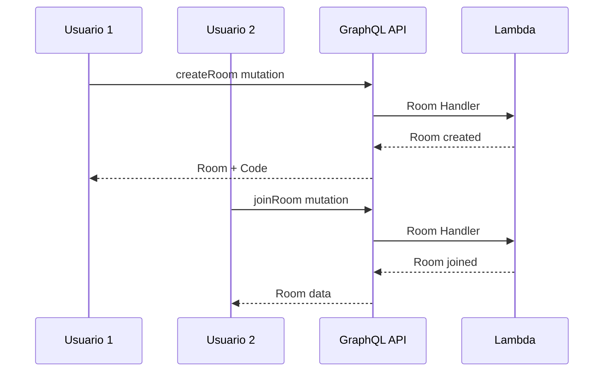
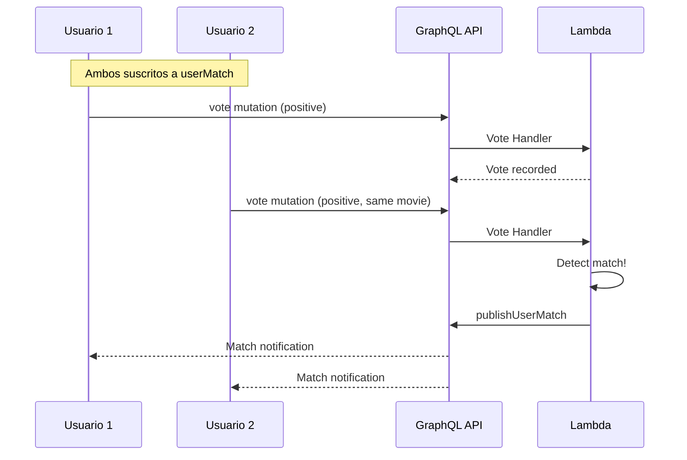

# Trinity - Esquemas GraphQL Detallados

## 🔗 ¿Qué es GraphQL?

GraphQL es un lenguaje de consulta y runtime para APIs que permite a los clientes solicitar exactamente los datos que necesitan. A diferencia de REST, donde múltiples endpoints devuelven estructuras fijas, GraphQL proporciona un único endpoint con máxima flexibilidad.

### Ventajas sobre REST en Trinity
```
REST (Múltiples Requests):
GET /rooms/123           → Room data
GET /rooms/123/members   → Members list  
GET /users/456          → User details

GraphQL (Single Request):
query {
  getRoom(id: "123") {
    id
    code
    members { name email }
    host { name }
  }
}
```

## 📋 Esquema Completo de Trinity

### Tipos Base

#### Room - Sala de Votación
```graphql
type Room {
  id: ID!                           # UUID único de la sala
  code: String!                     # Código de 6 caracteres (A-Z, 0-9)
  hostId: String!                   # ID del usuario creador
  mediaType: MediaType!             # MOVIE o TV
  genreIds: [Int!]!                # IDs de géneros TMDB (máx 2)
  candidates: [MovieCandidate!]!    # Películas candidatas
  createdAt: AWSDateTime!           # Timestamp de creación
}
```

**Explicación de Campos:**
- `ID!`: Tipo escalar no-nullable, representa identificadores únicos
- `String!`: Cadena de texto requerida
- `[Int!]!`: Array no-nullable de enteros no-nullable
- `AWSDateTime!`: Tipo personalizado de AWS para timestamps ISO 8601

#### MovieCandidate - Candidato de Película
```graphql
type MovieCandidate {
  id: Int!                          # ID de TMDB
  title: String!                    # Título de la película/serie
  overview: String!                 # Sinopsis
  posterPath: String                # URL del poster (nullable)
  releaseDate: String               # Fecha de estreno
  mediaType: MediaType!             # MOVIE o TV
}
```

#### Match - Coincidencia Encontrada
```graphql
type Match {
  id: ID!                           # UUID único del match
  roomId: String!                   # ID de la sala donde ocurrió
  movieId: Int!                     # ID de TMDB de la película
  title: String!                    # Título de la película
  posterPath: String                # URL del poster (nullable)
  timestamp: AWSDateTime!           # Cuándo se encontró el match
  matchedUsers: [String!]!          # IDs de usuarios que hicieron match
}
```

#### Vote - Voto Individual
```graphql
type Vote {
  roomId: String!                   # ID de la sala
  userId: String!                   # ID del usuario
  movieId: Int!                     # ID de la película
  vote: Boolean!                    # true = positivo, false = negativo
}
```

### Enums - Valores Predefinidos

#### MediaType - Tipo de Media
```graphql
enum MediaType {
  MOVIE                             # Películas
  TV                               # Series de televisión
}
```

**Ventajas de Enums:**
- Validación automática de valores
- Autocompletado en IDEs
- Documentación clara de opciones válidas

### Inputs - Datos de Entrada

#### CreateRoomInput - Crear Sala
```graphql
input CreateRoomInput {
  mediaType: MediaType!             # Tipo de contenido
  genreIds: [Int!]!                # Géneros seleccionados (máx 2)
}
```

#### VoteInput - Emitir Voto
```graphql
input VoteInput {
  roomId: String!                   # Sala donde votar
  movieId: Int!                     # Película a votar
  vote: Boolean!                    # Voto positivo/negativo
}
```

#### CreateMatchInput - Crear Match (Interno)
```graphql
input CreateMatchInput {
  roomId: String!                   # Sala del match
  movieId: Int!                     # Película del match
  title: String!                    # Título de la película
  posterPath: String                # URL del poster
  matchedUsers: [String!]!          # Usuarios que hicieron match
}
```

### Tipos de Respuesta

#### VoteResult - Resultado de Votación
```graphql
type VoteResult {
  success: Boolean!                 # Si el voto se procesó correctamente
  match: Match                      # Match encontrado (si aplica)
}
```

**Patrón de Respuesta:**
- Siempre incluye `success` para indicar estado
- Datos opcionales solo cuando son relevantes
- Permite manejar casos de éxito sin datos adicionales

## 🔍 Queries - Consultas de Datos

### getMyRooms - Mis Salas Activas
```graphql
type Query {
  getMyRooms: [Room!]!
}
```

**Comportamiento:**
- Retorna salas donde el usuario es host o participante
- Filtra salas expiradas (TTL)
- Excluye salas que ya tienen matches
- Ordenadas por fecha de creación (más recientes primero)

**Ejemplo de Uso:**
```graphql
query GetMyActiveRooms {
  getMyRooms {
    id
    code
    mediaType
    genreIds
    createdAt
    candidates {
      id
      title
      posterPath
    }
  }
}
```

### getRoom - Sala Específica
```graphql
type Query {
  getRoom(id: String!): Room
}
```

**Comportamiento:**
- Retorna sala por ID si existe y no ha expirado
- Null si no existe o ha expirado
- Accesible por cualquier usuario autenticado

### getMyMatches - Mis Matches
```graphql
type Query {
  getMyMatches: [Match!]!
}
```

**Comportamiento:**
- Retorna todos los matches donde el usuario participó
- Ordenados por timestamp descendente
- Incluye detalles completos de la película

### checkUserMatches - Verificar Matches (Polling)
```graphql
type Query {
  checkUserMatches: [Match!]!
}
```

**Propósito:**
- Usado por el sistema de polling como fallback
- Misma funcionalidad que `getMyMatches`
- Optimizado para llamadas frecuentes

## ✏️ Mutations - Modificación de Datos

### createRoom - Crear Nueva Sala
```graphql
type Mutation {
  createRoom(input: CreateRoomInput!): Room!
}
```

**Flujo Interno:**
1. Validar input (mediaType, genreIds)
2. Generar código único de 6 caracteres
3. Obtener candidatos de TMDB
4. Crear registro en DynamoDB
5. Registrar participación del host
6. Retornar sala creada

**Ejemplo de Uso:**
```graphql
mutation CreateMovieRoom {
  createRoom(input: {
    mediaType: MOVIE
    genreIds: [28, 12]  # Action, Adventure
  }) {
    id
    code
    candidates {
      id
      title
      overview
      posterPath
    }
  }
}
```

### joinRoom - Unirse a Sala
```graphql
type Mutation {
  joinRoom(code: String!): Room!
}
```

**Flujo Interno:**
1. Buscar sala por código (GSI)
2. Validar que sala existe y no ha expirado
3. Registrar participación del usuario
4. Retornar datos de la sala

**Validaciones:**
- Código debe existir
- Sala no debe haber expirado
- Usuario debe estar autenticado

### vote - Emitir Voto
```graphql
type Mutation {
  vote(input: VoteInput!): VoteResult!
}
```

**Flujo Interno:**
1. Validar que sala existe
2. Registrar voto en DynamoDB
3. Si voto es positivo, verificar matches
4. Si hay match, crear registro y notificar
5. Retornar resultado

**Lógica de Match:**
```
Match = (Votos Positivos == Total Usuarios) && (Total Usuarios > 1)
```

### createMatch - Crear Match (Interno)
```graphql
type Mutation {
  createMatch(input: CreateMatchInput!): Match!
}
```

**Uso:**
- Solo usado internamente por Vote Handler
- No expuesto a clientes directamente
- Crea registro permanente del match

## 📡 Subscriptions - Datos en Tiempo Real

### userMatch - Notificaciones de Match por Usuario
```graphql
type Subscription {
  userMatch(userId: ID!): UserMatchEvent
    @aws_subscribe(mutations: ["publishUserMatch"])
    @aws_iam
    @aws_cognito_user_pools
}
```

**Comportamiento:**
- Cliente se suscribe con su userId
- Recibe notificación cuando encuentra match
- Conexión WebSocket persistente
- Reconexión automática

### roomMatch - Notificaciones de Match por Sala
```graphql
type Subscription {
  roomMatch(roomId: ID!): RoomMatchEvent
    @aws_subscribe(mutations: ["publishRoomMatch"])
    @aws_iam
    @aws_cognito_user_pools
}
```

**Uso:**
- Todos los usuarios en una sala se suscriben
- Notificación broadcast cuando hay match
- Útil para UI en tiempo real

### Tipos de Eventos

#### UserMatchEvent - Evento de Match Personal
```graphql
type UserMatchEvent @aws_iam {
  userId: ID!                       # Usuario que recibe la notificación
  roomId: ID!                       # Sala donde ocurrió el match
  matchId: ID!                      # ID único del match
  movieId: ID!                      # ID de la película
  movieTitle: String!               # Título de la película
  posterPath: String                # URL del poster
  matchedUsers: [String!]!          # Todos los usuarios del match
  timestamp: AWSDateTime!           # Cuándo ocurrió
  matchDetails: MatchDetails        # Detalles adicionales
}
```

#### RoomMatchEvent - Evento de Match de Sala
```graphql
type RoomMatchEvent @aws_iam {
  roomId: ID!                       # Sala donde ocurrió
  matchId: ID!                      # ID del match
  movieId: ID!                      # Película del match
  movieTitle: String!               # Título
  posterPath: String                # Poster
  matchedUsers: [String!]!          # Usuarios participantes
  timestamp: AWSDateTime!           # Timestamp
  matchDetails: MatchDetails        # Detalles del match
}
```

#### MatchDetails - Detalles del Match
```graphql
type MatchDetails @aws_iam {
  voteCount: Int!                   # Número de votos positivos
  requiredVotes: Int!               # Votos necesarios para match
  matchType: String!                # Tipo de match ("UNANIMOUS")
}
```

## 🔐 Directivas de Autorización

### @aws_auth - Autenticación Cognito
```graphql
type Query {
  getMyRooms: [Room!]! 
    @aws_auth(cognito_groups: ["Users"])
}
```

**Comportamiento:**
- Requiere token JWT válido de Cognito
- Usuario debe pertenecer al grupo "Users"
- Token validado automáticamente por AppSync

### @aws_iam - Autorización IAM
```graphql
type Mutation {
  publishUserMatch(userId: ID!, matchData: RoomMatchInput!): UserMatchEvent!
    @aws_iam
}
```

**Uso:**
- Para funciones Lambda internas
- Usa roles IAM en lugar de tokens de usuario
- Permite comunicación entre servicios

### @aws_subscribe - Configuración de Subscriptions
```graphql
type Subscription {
  userMatch(userId: ID!): UserMatchEvent
    @aws_subscribe(mutations: ["publishUserMatch"])
}
```

**Configuración:**
- Define qué mutations activan la subscription
- AppSync maneja automáticamente la propagación
- Filtra eventos por parámetros (userId)

## 🔄 Flujos de Datos GraphQL

### Flujo: Crear y Unirse a Sala


### Flujo: Votación y Match


## 📊 Optimizaciones GraphQL

### Resolvers Eficientes
- **Batch Loading**: Múltiples requests combinados
- **Caching**: Resultados frecuentes cacheados
- **Field-level Caching**: Cache por campo específico

### Query Complexity Analysis
```graphql
# ✅ Query eficiente
query GetBasicRooms {
  getMyRooms {
    id
    code
    mediaType
  }
}

# ⚠️ Query compleja (usar con cuidado)
query GetDetailedRooms {
  getMyRooms {
    id
    code
    candidates {
      id
      title
      overview
      # Muchos campos anidados
    }
  }
}
```

### Paginación (Futura Implementación)
```graphql
type Query {
  getMyRooms(first: Int, after: String): RoomConnection
}

type RoomConnection {
  edges: [RoomEdge!]!
  pageInfo: PageInfo!
}

type RoomEdge {
  node: Room!
  cursor: String!
}
```

## 🧪 Testing GraphQL

### Queries de Prueba
```graphql
# Test: Crear sala
mutation TestCreateRoom {
  createRoom(input: {
    mediaType: MOVIE
    genreIds: [28]
  }) {
    id
    code
    candidates {
      id
      title
    }
  }
}

# Test: Votar
mutation TestVote {
  vote(input: {
    roomId: "room-123"
    movieId: 550
    vote: true
  }) {
    success
    match {
      id
      title
    }
  }
}
```

### Validación de Schema
```bash
# Validar schema
npx graphql-schema-linter schema.graphql

# Generar tipos TypeScript
npx graphql-codegen
```

---

Este esquema GraphQL proporciona a Trinity una API flexible, tipada y eficiente que permite a los clientes obtener exactamente los datos que necesitan mientras mantiene la consistencia y seguridad en todas las operaciones.