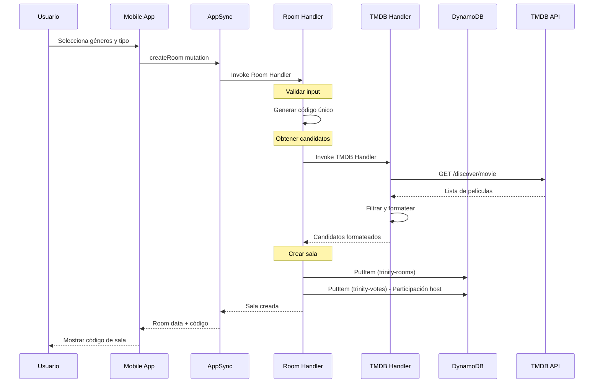
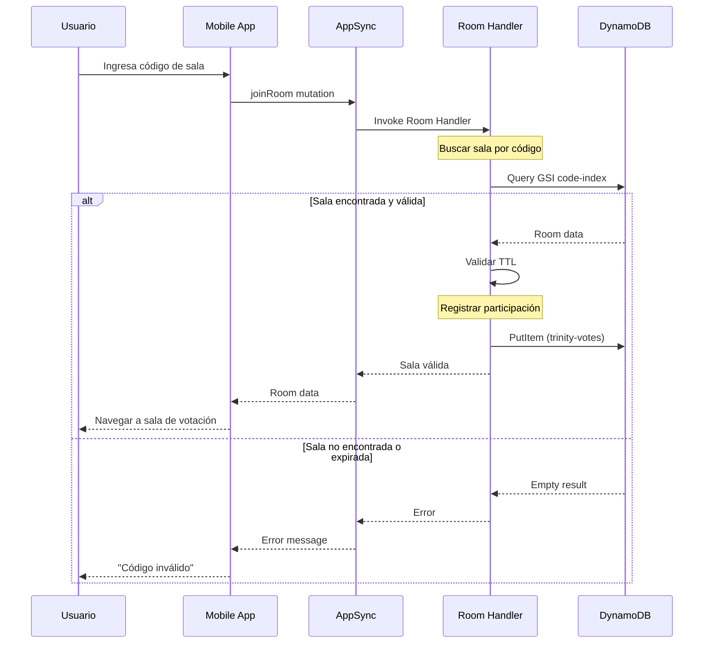
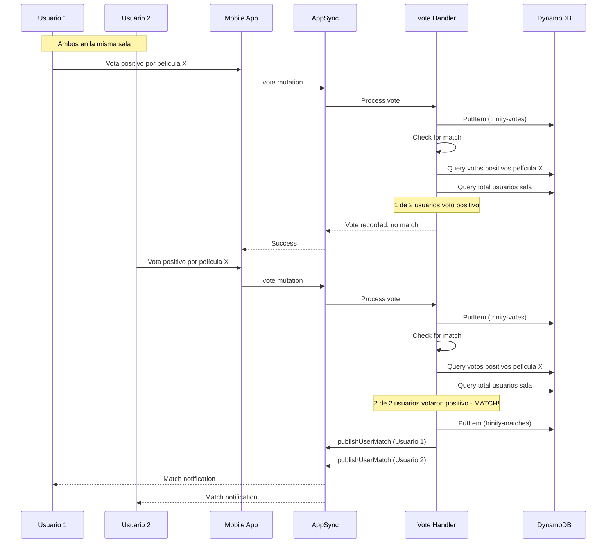
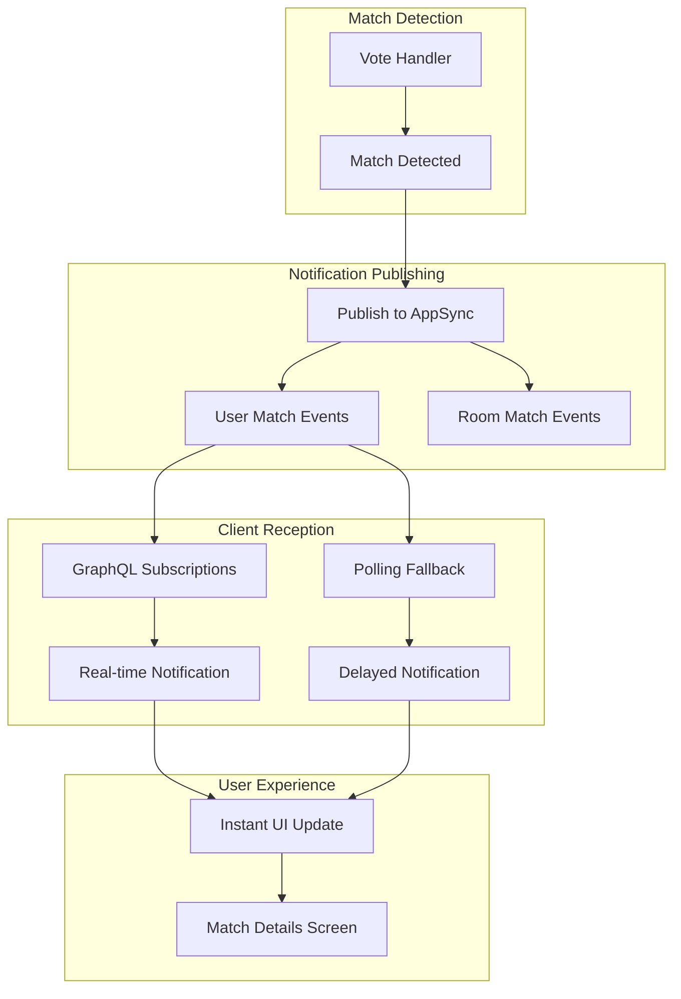
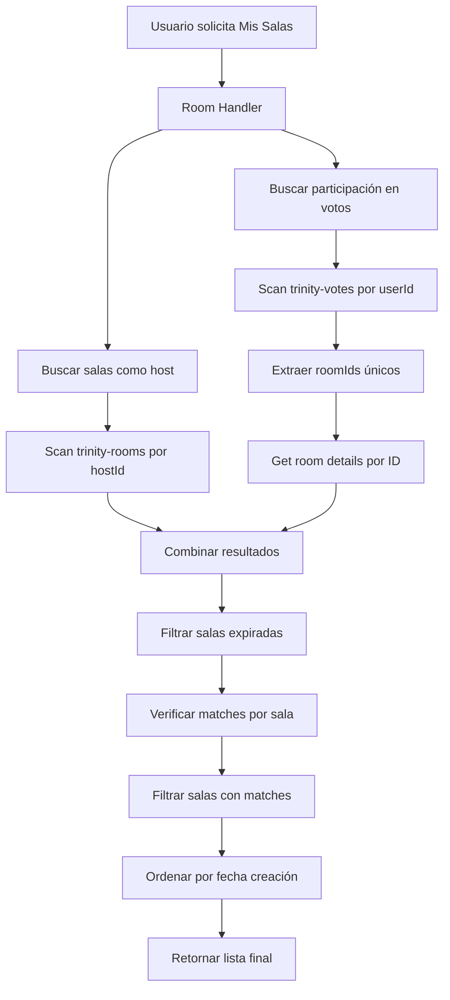
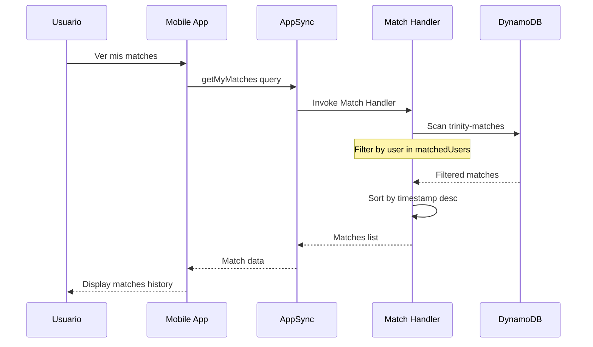

# Trinity - Flujos de Aplicación Detallados

## 🔄 Flujos Principales de Trinity

Trinity maneja varios flujos críticos que involucran múltiples servicios AWS trabajando en conjunto. Cada flujo está diseñado para ser robusto, escalable y proporcionar una experiencia de usuario fluida.

## 🏠 Flujo 1: Creación de Sala

### Descripción
Un usuario crea una nueva sala de votación especificando el tipo de contenido (película/serie) y hasta 2 géneros. El sistema genera un código único y obtiene candidatos de películas de TMDB.

### Actores
- **Usuario**: Creador de la sala
- **Mobile App**: Interfaz React Native
- **AppSync**: API GraphQL
- **Room Handler**: Lambda de gestión de salas
- **TMDB Handler**: Lambda de integración con TMDB
- **DynamoDB**: Almacenamiento de datos

### Diagrama de Secuencia


### Pasos Detallados

#### 1. Validación de Input
```typescript
// Room Handler valida entrada
if (!mediaType || !['MOVIE', 'TV'].includes(mediaType)) {
  throw new Error('Invalid mediaType');
}

if (genreIds.length > 2) {
  throw new Error('Maximum 2 genres allowed');
}
```

#### 2. Generación de Código Único
```typescript
// Algoritmo de generación con verificación de unicidad
async generateUniqueCode(): Promise<string> {
  let attempts = 0;
  while (attempts < 10) {
    const code = generateRandomCode(); // 6 caracteres A-Z, 0-9
    
    // Verificar unicidad usando GSI
    const existing = await queryByCode(code);
    if (!existing) {
      return code;
    }
    attempts++;
  }
  throw new Error('Failed to generate unique code');
}
```

#### 3. Obtención de Candidatos TMDB
```typescript
// TMDB Handler construye query optimizada
const params = {
  with_genres: genreIds.join(','),
  sort_by: 'popularity.desc',
  'vote_average.gte': '6.0',
  'vote_count.gte': '100',
  page: 1
};
```

#### 4. Almacenamiento en DynamoDB
```typescript
// Crear registro de sala
const room = {
  id: randomUUID(),
  code: uniqueCode,
  hostId: userId,
  mediaType,
  genreIds,
  candidates,
  createdAt: new Date().toISOString(),
  ttl: Math.floor(Date.now() / 1000) + (24 * 60 * 60) // 24h
};

// Registrar participación automática del host
const participation = {
  roomId: room.id,
  userMovieId: `${userId}#JOINED`,
  userId,
  movieId: -1,
  vote: false,
  isParticipation: true,
  timestamp: new Date().toISOString()
};
```

### Manejo de Errores
- **TMDB API Down**: Retorna sala con candidatos vacíos
- **Código Duplicado**: Reintentos automáticos hasta 10 veces
- **DynamoDB Error**: Rollback y error al usuario

## 🚪 Flujo 2: Unirse a Sala

### Descripción
Un usuario se une a una sala existente usando un código de 6 caracteres. El sistema valida el código, verifica que la sala no haya expirado y registra la participación.

### Diagrama de Secuencia


### Validaciones Implementadas

#### 1. Formato de Código
```typescript
const codeRegex = /^[A-Z0-9]{6}$/;
if (!codeRegex.test(code)) {
  throw new Error('Invalid code format');
}
```

#### 2. Existencia de Sala
```typescript
// Query usando GSI para eficiencia
const result = await docClient.send(new QueryCommand({
  TableName: 'trinity-rooms',
  IndexName: 'code-index',
  KeyConditionExpression: 'code = :code',
  ExpressionAttributeValues: { ':code': code.toUpperCase() }
}));

if (!result.Items || result.Items.length === 0) {
  throw new Error('Room not found');
}
```

#### 3. Validación de TTL
```typescript
const now = Math.floor(Date.now() / 1000);
if (room.ttl && room.ttl < now) {
  throw new Error('Room has expired');
}
```

### Fallback para GSI
```typescript
// Si GSI no está disponible, usar scan como fallback
try {
  return await queryByGSI(code);
} catch (error) {
  console.log('GSI not available, using scan fallback');
  return await scanByCode(code);
}
```

## 🗳️ Flujo 3: Proceso de Votación

### Descripción
Los usuarios votan por películas candidatas. El sistema registra cada voto y verifica automáticamente si se ha producido un match (todos votan positivamente por la misma película).

### Diagrama de Secuencia


### Algoritmo de Detección de Matches

#### 1. Registrar Voto
```typescript
const voteRecord = {
  roomId,
  userMovieId: `${userId}#${movieId}`,
  userId,
  movieId,
  vote,
  timestamp: new Date().toISOString()
};

await docClient.send(new PutCommand({
  TableName: 'trinity-votes',
  Item: voteRecord
}));
```

#### 2. Verificar Match (Solo para Votos Positivos)
```typescript
if (!vote) {
  return { success: true }; // No verificar matches para votos negativos
}

// Obtener votos positivos para esta película
const positiveVotes = await getPositiveVotes(roomId, movieId);

// Obtener total de usuarios únicos en la sala
const totalUsers = await getTotalUsers(roomId);

// Verificar unanimidad
if (positiveVotes.length === totalUsers.length && totalUsers.length > 1) {
  return await createMatch(roomId, movieId, positiveVotes);
}
```

#### 3. Crear Match
```typescript
async createMatch(roomId: string, movieId: number, users: string[]): Promise<Match> {
  const match = {
    roomId,
    movieId,
    matchId: randomUUID(),
    title: await getMovieTitle(movieId),
    posterPath: await getMoviePoster(movieId),
    matchedUsers: users,
    timestamp: new Date().toISOString()
  };
  
  // Almacenar match
  await docClient.send(new PutCommand({
    TableName: 'trinity-matches',
    Item: match
  }));
  
  return match;
}
```

### Prevención de Condiciones de Carrera
```typescript
// Usar transacciones para operaciones críticas
const transactItems = [
  {
    Put: {
      TableName: 'trinity-votes',
      Item: voteRecord,
      ConditionExpression: 'attribute_not_exists(userMovieId) OR userMovieId = :userMovieId',
      ExpressionAttributeValues: { ':userMovieId': voteRecord.userMovieId }
    }
  }
];

await docClient.send(new TransactWriteCommand({
  TransactItems: transactItems
}));
```

## 🔔 Flujo 4: Sistema de Notificaciones

### Descripción
Cuando se detecta un match, el sistema envía notificaciones en tiempo real a todos los usuarios participantes usando GraphQL subscriptions y polling como fallback.

### Diagrama de Arquitectura de Notificaciones


### Implementación de Subscriptions

#### 1. Publicación de Eventos
```typescript
// Vote Handler publica eventos para cada usuario
for (const userId of matchedUsers) {
  await graphqlClient.request(`
    mutation PublishUserMatch($userId: ID!, $matchData: RoomMatchInput!) {
      publishUserMatch(userId: $userId, matchData: $matchData) {
        userId
        matchId
        movieTitle
      }
    }
  `, {
    userId,
    matchData: {
      matchId: match.matchId,
      movieId: match.movieId,
      movieTitle: match.title,
      posterPath: match.posterPath,
      matchedUsers: match.matchedUsers,
      timestamp: match.timestamp
    }
  });
}
```

#### 2. Suscripción del Cliente
```typescript
// Mobile app se suscribe a matches del usuario
const subscription = client.graphql({
  query: `
    subscription UserMatch($userId: ID!) {
      userMatch(userId: $userId) {
        matchId
        movieTitle
        posterPath
        matchedUsers
        timestamp
      }
    }
  `,
  variables: { userId: currentUser.id },
  authMode: 'userPool'
}).subscribe({
  next: ({ data }) => {
    if (data?.userMatch) {
      showMatchNotification(data.userMatch);
      navigateToMatchScreen(data.userMatch);
    }
  },
  error: (error) => {
    console.error('Subscription error:', error);
    // Activar polling como fallback
    startPollingFallback();
  }
});
```

#### 3. Polling Fallback
```typescript
// Sistema de polling como respaldo
class MatchPollingService {
  private pollingInterval: NodeJS.Timeout | null = null;
  private lastCheckTimestamp: string = new Date().toISOString();

  startPolling(userId: string, onMatch: (match: Match) => void) {
    this.pollingInterval = setInterval(async () => {
      try {
        const matches = await this.checkForNewMatches(userId);
        matches.forEach(onMatch);
      } catch (error) {
        console.error('Polling error:', error);
      }
    }, 2000); // Poll cada 2 segundos
  }

  private async checkForNewMatches(userId: string): Promise<Match[]> {
    const response = await client.graphql({
      query: CHECK_USER_MATCHES,
      variables: { userId },
      authMode: 'userPool'
    });

    const allMatches = response.data.checkUserMatches;
    
    // Filtrar solo matches nuevos
    return allMatches.filter(match => 
      match.timestamp > this.lastCheckTimestamp
    );
  }
}
```

## 📋 Flujo 5: Consulta de Mis Salas

### Descripción
El usuario consulta las salas donde participa que aún no tienen matches. El sistema busca en múltiples fuentes y filtra según criterios específicos.

### Diagrama de Flujo de Datos


### Implementación Detallada

#### 1. Obtener Salas como Host
```typescript
async getRoomsAsHost(userId: string): Promise<Room[]> {
  const result = await docClient.send(new ScanCommand({
    TableName: 'trinity-rooms',
    FilterExpression: 'hostId = :userId',
    ExpressionAttributeValues: { ':userId': userId }
  }));
  
  return result.Items as Room[];
}
```

#### 2. Obtener Salas por Participación
```typescript
async getRoomsByParticipation(userId: string): Promise<Room[]> {
  // Obtener registros de participación
  const votesResult = await docClient.send(new ScanCommand({
    TableName: 'trinity-votes',
    FilterExpression: 'userId = :userId',
    ExpressionAttributeValues: { ':userId': userId }
  }));
  
  // Extraer IDs únicos de salas
  const roomIds = new Set(
    votesResult.Items?.map(item => item.roomId) || []
  );
  
  // Obtener detalles de cada sala
  const rooms = await Promise.all(
    Array.from(roomIds).map(async (roomId) => {
      const roomResult = await docClient.send(new GetCommand({
        TableName: 'trinity-rooms',
        Key: { id: roomId }
      }));
      return roomResult.Item as Room;
    })
  );
  
  return rooms.filter(room => room !== null);
}
```

#### 3. Filtrar Salas con Matches
```typescript
async filterRoomsWithoutMatches(rooms: Room[]): Promise<Room[]> {
  const roomsWithoutMatches = [];
  
  for (const room of rooms) {
    const hasMatches = await this.checkRoomHasMatches(room.id);
    if (!hasMatches) {
      roomsWithoutMatches.push(room);
    }
  }
  
  return roomsWithoutMatches;
}

private async checkRoomHasMatches(roomId: string): Promise<boolean> {
  const result = await docClient.send(new QueryCommand({
    TableName: 'trinity-matches',
    KeyConditionExpression: 'roomId = :roomId',
    ExpressionAttributeValues: { ':roomId': roomId },
    Limit: 1 // Solo necesitamos saber si existe alguno
  }));
  
  return (result.Items?.length || 0) > 0;
}
```

## 🔍 Flujo 6: Consulta de Mis Matches

### Descripción
El usuario consulta su historial de matches encontrados. El sistema busca en la tabla de matches y retorna los resultados ordenados cronológicamente.

### Diagrama Simplificado


### Optimización con GSI (Futura)
```typescript
// GSI propuesto para optimizar consultas por usuario
interface UserMatchesGSI {
  userId: string;        // GSI PK
  timestamp: string;     // GSI SK
  roomId: string;        // Projected attribute
  movieId: number;       // Projected attribute
  matchId: string;       // Projected attribute
}

// Query optimizada
const result = await docClient.send(new QueryCommand({
  TableName: 'trinity-matches',
  IndexName: 'user-matches-index',
  KeyConditionExpression: 'userId = :userId',
  ExpressionAttributeValues: { ':userId': userId },
  ScanIndexForward: false // Orden descendente por timestamp
}));
```

## 📊 Métricas y Monitoreo de Flujos

### Métricas por Flujo
```typescript
// Métricas personalizadas para cada flujo
const metrics = {
  'room.creation.duration': 'Tiempo de creación de sala',
  'room.join.success_rate': 'Tasa de éxito al unirse',
  'vote.processing.latency': 'Latencia de procesamiento de votos',
  'match.detection.accuracy': 'Precisión de detección de matches',
  'notification.delivery.time': 'Tiempo de entrega de notificaciones'
};

// Logging estructurado
console.log(JSON.stringify({
  metric: 'room.creation.duration',
  value: processingTime,
  userId: userId,
  roomId: roomId,
  timestamp: new Date().toISOString()
}));
```

### Dashboards de Monitoreo
- **Flujo de Creación**: Tiempo promedio, tasa de éxito, errores TMDB
- **Flujo de Votación**: Latencia, matches por hora, errores de concurrencia
- **Sistema de Notificaciones**: Tasa de entrega, latencia, fallbacks activados

---

Estos flujos detallados muestran cómo Trinity orquesta múltiples servicios AWS para proporcionar una experiencia de usuario fluida y confiable, con manejo robusto de errores y optimizaciones de performance en cada paso.