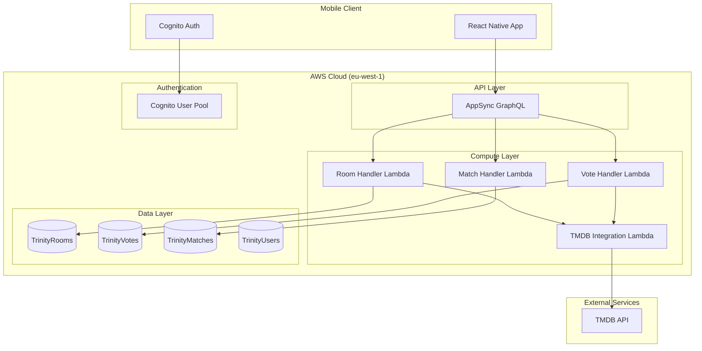

# Trinity Infrastructure

AWS CDK v2 infrastructure for the Trinity Movie Voting Application.

## Architecture Overview



## Data Flow

### Room Creation Flow
1. Mobile App → AppSync GraphQL → Room Handler Lambda
2. Room Handler → TMDB Integration Lambda → TMDB API
3. TMDB Lambda applies Latin Script Validator
4. Filtered candidates stored in TrinityRooms table
5. Room code generated and returned to mobile app

### Voting Flow
1. Mobile App → AppSync GraphQL → Vote Handler Lambda
2. Vote recorded in TrinityVotes table
3. Vote Handler checks for matches across all room participants
4. If match detected → Match Handler Lambda creates match record
5. Match notification sent to all participants

### Match Detection Logic
- All active users in room must vote positively for same content
- Match Handler creates record in TrinityMatches table
- Real-time notifications sent via AppSync subscriptions

## Infrastructure Components

### DynamoDB Tables

#### TrinityRooms
- **Partition Key**: `id` (UUID)
- **GSI**: `code-index` (6-character room code)
- **TTL**: Auto-expire after 24 hours
- **Purpose**: Store room configuration and movie candidates

#### TrinityVotes
- **Partition Key**: `roomId`
- **Sort Key**: `userMovieId` (format: "userId#movieId")
- **Purpose**: Record individual user votes

#### TrinityMatches
- **Partition Key**: `roomId`
- **Sort Key**: `movieId`
- **LSI**: `timestamp-index` for chronological queries
- **Purpose**: Store detected matches

#### TrinityUsers
- **Partition Key**: `id` (Cognito User ID)
- **Purpose**: User profile and activity tracking

### Lambda Functions

#### TMDB Integration Lambda
- **Purpose**: Interface with TMDB API and apply content filtering
- **Key Features**:
  - Bearer token authentication
  - Latin Script Validator (regex-based character filtering)
  - Media type enforcement (MOVIE vs TV)
  - Western language filtering (en,es,fr,it,de,pt)

#### Room Handler Lambda
- **Purpose**: Room creation and joining operations
- **Key Features**:
  - Unique room code generation
  - Genre validation (max 2 genres)
  - TMDB Lambda integration for candidate fetching

#### Vote Handler Lambda
- **Purpose**: Vote processing and match detection
- **Key Features**:
  - Vote persistence with user/movie/room association
  - Real-time match detection logic
  - Match Handler integration

#### Match Handler Lambda
- **Purpose**: Match management and user history
- **Key Features**:
  - Match record creation
  - User match history retrieval
  - Notification handling

### AppSync GraphQL API

#### Mutations
- `createRoom(input: CreateRoomInput!)`: Create new voting room
- `joinRoom(code: String!)`: Join existing room by code
- `vote(input: VoteInput!)`: Submit vote and check for matches

#### Queries
- `getRoom(id: String!)`: Get room details and candidates
- `getMyMatches`: Retrieve user's match history

#### Authentication
- Cognito User Pool integration
- JWT token validation
- User context injection into Lambda resolvers

## Environment Variables

Lambda functions use the following environment variables:

### TMDB Configuration
- `TMDB_API_KEY`: TMDB API key
- `TMDB_READ_TOKEN`: Bearer token for TMDB API
- `TMDB_BASE_URL`: TMDB API base URL

### DynamoDB Tables
- `ROOMS_TABLE`: TrinityRooms table name
- `VOTES_TABLE`: TrinityVotes table name
- `MATCHES_TABLE`: TrinityMatches table name
- `USERS_TABLE`: TrinityUsers table name

### Lambda Integration
- `TMDB_LAMBDA_ARN`: ARN of TMDB Integration Lambda

## Deployment

### Prerequisites
- AWS CLI configured with appropriate credentials
- CDK CLI installed: `npm install -g aws-cdk`
- Node.js 18+ and npm

### Bootstrap CDK (First time only)
```bash
cdk bootstrap aws://847850007406/eu-west-1
```

### Deploy Infrastructure
```bash
npm install
npm run build
npm run deploy
```

### Generate Mobile Configuration
```bash
npm run generate-config
```

## Security

### IAM Permissions
- Lambda functions have least-privilege access to DynamoDB tables
- AppSync uses Cognito User Pool for authentication
- Cross-Lambda invocation permissions granted explicitly

### Data Protection
- DynamoDB Point-in-Time Recovery enabled
- CloudWatch logging for all components
- X-Ray tracing enabled for performance monitoring

### Content Filtering
- Latin Script Validator prevents non-readable content
- Western language filtering ensures content quality
- Media type enforcement prevents content mixing

## Monitoring

### CloudWatch Logs
- All Lambda functions log to CloudWatch
- AppSync field-level logging enabled
- Structured logging with correlation IDs

### X-Ray Tracing
- End-to-end request tracing
- Performance bottleneck identification
- Error correlation across services

### Metrics
- Lambda function duration and error rates
- DynamoDB read/write capacity utilization
- AppSync request/response metrics

## Cost Optimization

### On-Demand Pricing
- DynamoDB tables use on-demand capacity
- Lambda functions scale to zero when not in use
- AppSync charges per request

### Resource Cleanup
- Room TTL prevents data accumulation
- Development stacks use DESTROY removal policy
- Unused resources automatically cleaned up