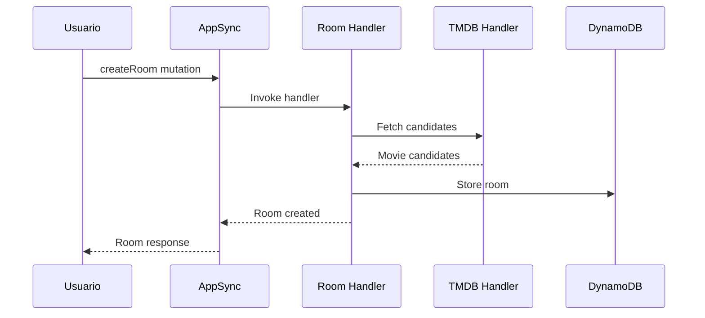
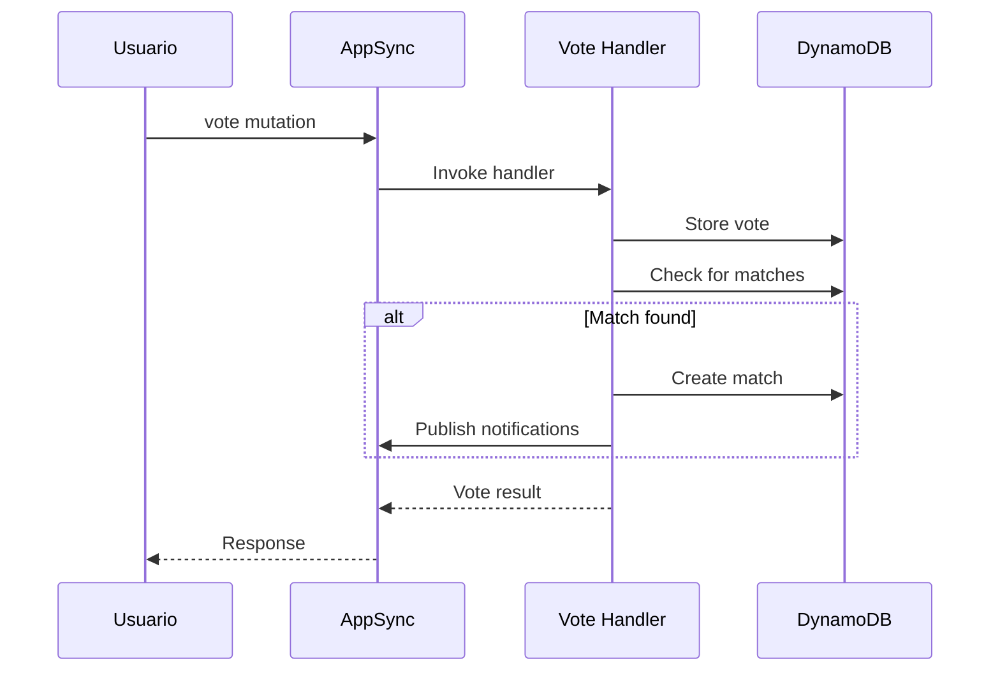

# Trinity Infrastructure

Infraestructura AWS para la aplicación Trinity Movie Matching usando AWS CDK.

## 🏗️ Arquitectura

### Servicios AWS Utilizados

- **AWS AppSync**: API GraphQL principal
- **Amazon Cognito**: Autenticación y gestión de usuarios
- **AWS Lambda**: Funciones serverless para lógica de negocio
- **Amazon DynamoDB**: Base de datos NoSQL
- **AWS IAM**: Gestión de permisos y roles

### Componentes

```
infrastructure/
├── lib/
│   └── trinity-stack.ts     # Stack principal de CDK
├── src/handlers/            # Lambda functions
│   ├── tmdb/               # Integración TMDB
│   │   ├── index.ts        # Handler principal
│   │   └── package.json    # Dependencias
│   ├── room/               # Gestión de salas
│   │   ├── index.ts        # Handler principal
│   │   └── package.json    # Dependencias
│   ├── vote/               # Procesamiento de votos
│   │   ├── index.ts        # Handler principal
│   │   └── package.json    # Dependencias
│   └── match/              # Gestión de matches
│       ├── index.ts        # Handler principal
│       └── package.json    # Dependencias
├── schema.graphql          # Esquema GraphQL
├── cdk.json               # Configuración CDK
├── package.json           # Dependencias del proyecto
└── tsconfig.json          # Configuración TypeScript
```

## 🗄️ Modelo de Datos

### Tablas DynamoDB

#### trinity-rooms
Almacena información de las salas de votación.

**Estructura:**
- **Partition Key**: `id` (String) - UUID único de la sala
- **GSI**: `code-index` - Índice por código de sala
- **TTL**: `ttl` - Expiración automática después de 24h

**Atributos:**
```typescript
{
  id: string;           // UUID único
  code: string;         // Código de 6 caracteres (A-Z, 0-9)
  hostId: string;       // ID del usuario creador
  mediaType: 'MOVIE' | 'TV';
  genreIds: number[];   // IDs de géneros TMDB (máx 2)
  candidates: MovieCandidate[];
  createdAt: string;    // ISO timestamp
  ttl: number;          // Unix timestamp para expiración
}
```

#### trinity-votes
Almacena los votos de usuarios por películas.

**Estructura:**
- **Partition Key**: `roomId` (String)
- **Sort Key**: `userMovieId` (String) - Formato: `{userId}#{movieId}`

**Atributos:**
```typescript
{
  roomId: string;
  userMovieId: string;  // userId#movieId o userId#JOINED
  userId: string;
  movieId: number;      // TMDB ID (-1 para participación)
  vote: boolean;
  timestamp: string;
  isParticipation?: boolean; // Flag para registros de participación
}
```

#### trinity-matches
Almacena los matches encontrados.

**Estructura:**
- **Partition Key**: `roomId` (String)
- **Sort Key**: `movieId` (Number)

**Atributos:**
```typescript
{
  roomId: string;
  movieId: number;
  matchId: string;      // UUID único del match
  title: string;
  posterPath?: string;
  matchedUsers: string[];
  timestamp: string;
}
```

## 🔧 Lambda Functions

### TMDB Handler
**Función**: Integración con The Movie Database API
**Trigger**: Invocación directa desde Room Handler
**Responsabilidades**:
- Obtener candidatos de películas/series por género
- Filtrar y formatear resultados
- Manejar paginación y límites de API

**Environment Variables:**
- `TMDB_API_KEY`: API key de TMDB

### Room Handler
**Función**: Gestión de salas de votación
**Trigger**: GraphQL resolvers (AppSync)
**Responsabilidades**:
- Crear nuevas salas con códigos únicos
- Permitir unión a salas existentes
- Listar salas del usuario (sin matches)
- Registrar participación de usuarios

**Environment Variables:**
- `ROOMS_TABLE`: Nombre de tabla de salas
- `VOTES_TABLE`: Nombre de tabla de votos
- `MATCHES_TABLE`: Nombre de tabla de matches
- `TMDB_LAMBDA_ARN`: ARN de función TMDB

**GraphQL Operations:**
- `createRoom(input: CreateRoomInput!): Room!`
- `joinRoom(code: String!): Room!`
- `getMyRooms: [Room!]!`
- `getRoom(id: String!): Room`

### Vote Handler
**Función**: Procesamiento de votos y detección de matches
**Trigger**: GraphQL resolver (AppSync)
**Responsabilidades**:
- Registrar votos de usuarios
- Detectar matches automáticamente
- Publicar notificaciones de matches
- Validar integridad de votos

**Environment Variables:**
- `VOTES_TABLE`: Nombre de tabla de votos
- `MATCHES_TABLE`: Nombre de tabla de matches
- `ROOMS_TABLE`: Nombre de tabla de salas
- `GRAPHQL_ENDPOINT`: Endpoint de AppSync

**GraphQL Operations:**
- `vote(input: VoteInput!): VoteResult!`

### Match Handler
**Función**: Gestión de matches y consultas
**Trigger**: GraphQL resolver (AppSync)
**Responsabilidades**:
- Consultar matches del usuario
- Gestionar historial de matches
- Publicar eventos de matches

**Environment Variables:**
- `MATCHES_TABLE`: Nombre de tabla de matches
- `GRAPHQL_ENDPOINT`: Endpoint de AppSync

**GraphQL Operations:**
- `getMyMatches: [Match!]!`

## 🔄 Flujos de Datos

### Creación de Sala


### Proceso de Votación


## 🔐 Seguridad

### Autenticación
- **Cognito User Pool**: Gestión de usuarios
- **JWT Tokens**: Autenticación en GraphQL
- **User Pool Client**: Configuración de autenticación

### Autorización
```graphql
# Queries y Mutations protegidas
type Query {
  getMyRooms: [Room!]! @aws_auth(cognito_groups: ["Users"])
}

type Mutation {
  createRoom(input: CreateRoomInput!): Room! 
    @aws_auth(cognito_groups: ["Users"])
}

# Subscriptions con múltiples modos de auth
type Subscription {
  userMatch(userId: ID!): UserMatchEvent
    @aws_subscribe(mutations: ["publishUserMatch"])
    @aws_iam
    @aws_cognito_user_pools
}
```

### Permisos IAM
- Lambda functions tienen permisos mínimos necesarios
- Acceso granular a tablas DynamoDB
- Permisos de invocación entre funciones

## 📊 Monitoreo

### CloudWatch Logs
Todas las funciones Lambda generan logs estructurados:

```typescript
console.log(JSON.stringify({
  timestamp: new Date().toISOString(),
  level: 'INFO',
  service: 'room-handler',
  operation: 'createRoom',
  userId: 'user123',
  roomId: 'room456',
  success: true
}));
```

### Métricas Personalizadas
- Salas creadas por día
- Matches generados
- Errores por función
- Latencia de operaciones

## 🚀 Deployment

### Prerrequisitos
```bash
npm install -g aws-cdk
aws configure
```

### Variables de Entorno
Crear archivo `.env`:
```bash
TMDB_API_KEY=tu_api_key_aqui
AWS_REGION=eu-west-1
```

### Comandos de Deployment

#### Primera vez (Bootstrap)
```bash
npm install
cdk bootstrap
```

#### Deploy a Development
```bash
cdk deploy
```

#### Deploy a Production
```bash
cdk deploy --context environment=prod --require-approval broadening
```

#### Verificar Stack
```bash
cdk diff
cdk ls
```

### Outputs del Deploy
Después del deployment, obtendrás:
- `GraphQLEndpoint`: URL de la API GraphQL
- `UserPoolId`: ID del Cognito User Pool
- `UserPoolClientId`: ID del cliente de Cognito
- `Region`: Región AWS utilizada

## 🧪 Testing

### Unit Tests
```bash
npm test
```

### Integration Tests
```bash
npm run test:integration
```

### Manual Testing
Usar archivos de payload en `tests/` para probar funciones:

```bash
# Test TMDB function
aws lambda invoke --function-name TrinityStack-TmdbHandler \
  --payload file://tests/tmdb-payload.json response.json
```

## 🔧 Desarrollo Local

### Compilar TypeScript
```bash
npm run build
```

### Watch Mode
```bash
npm run watch
```

### Linting
```bash
npm run lint
```

## 📝 Configuración

### CDK Context
El archivo `cdk.json` contiene configuración específica:

```json
{
  "app": "npx ts-node bin/trinity.ts",
  "context": {
    "@aws-cdk/core:enableStackNameDuplicates": true,
    "aws-cdk:enableDiffNoFail": true
  }
}
```

### TypeScript Config
Configuración optimizada para AWS Lambda en `tsconfig.json`.

## 🚨 Troubleshooting

### Errores Comunes

#### "Table already exists"
```bash
cdk destroy
cdk deploy
```

#### "Function timeout"
Aumentar timeout en `trinity-stack.ts`:
```typescript
timeout: cdk.Duration.seconds(60)
```

#### "Permission denied"
Verificar roles IAM y permisos de tablas.

### Logs de Debug
```bash
# Ver logs de función específica
aws logs tail /aws/lambda/TrinityStack-RoomHandler --follow

# Ver logs de AppSync
aws logs tail /aws/appsync/apis/{api-id} --follow
```

## 📚 Referencias

- [AWS CDK TypeScript Reference](https://docs.aws.amazon.com/cdk/api/v2/typescript/)
- [AWS AppSync Developer Guide](https://docs.aws.amazon.com/appsync/)
- [DynamoDB Developer Guide](https://docs.aws.amazon.com/dynamodb/)
- [AWS Lambda Developer Guide](https://docs.aws.amazon.com/lambda/)